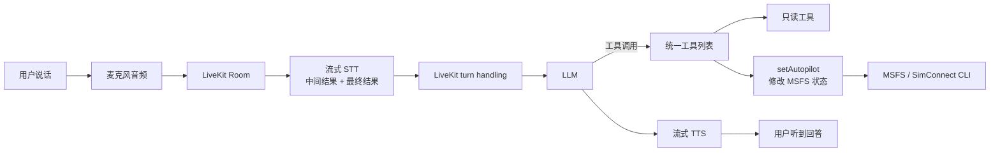
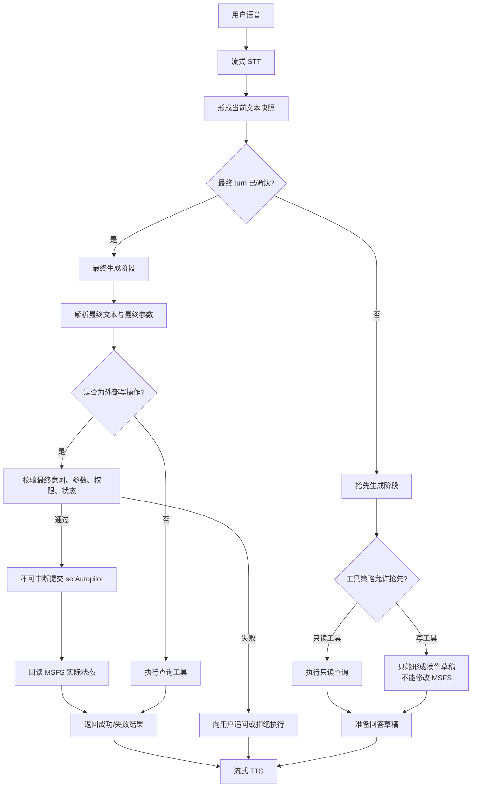
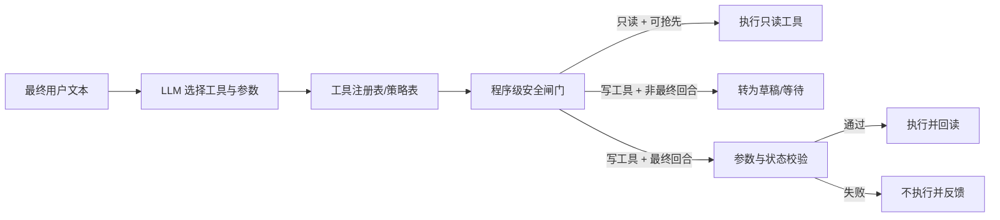

# LiveKit 语音 Agent 与 MSFS 控制工具的官方推荐架构

**适用项目**：微软模拟飞行 AI 导游助手  
**文档日期**：2026-08-27  
**文档目的**：说明 LiveKit Agents 对“流式 STT + 流式 LLM + 流式 TTS + 外部控制工具”场景的推荐用法，并给出本项目的落地方案。  
**关联 Bug 清单**：[Bug-20260826：AI 导游诊断包功能模块缺陷总览](../bugs/bug-20260826-ai-guide-diagnostics-review.md)

## 1. 先给结论

本方案对应 Bug 清单中的修复映射，见 [Bug 文档第 9 节“采用推荐方案后的修复映射”](../bugs/bug-20260826-ai-guide-diagnostics-review.md#9-采用推荐方案后的修复映射)。

官方并不是要求关闭所有流式能力，也不是要求 STT 完成后再重新启动一个完全独立的 AI。

官方推荐的基本思路是：

1. 音频、STT、LLM、TTS 都可以保持流式，以降低对话延迟。
2. LLM 可以在用户一句话还没有完全确认时提前生成回答，这叫 **preemptive generation（抢先生成）**。
3. 但是，改变外部状态的工具不能因为“草稿判断”就直接执行。
4. 对外部写操作要有应用层的安全边界：最终语音确认、不可中断提交、取消处理、幂等、防重复和执行结果回读。
5. 因此，对本项目最合适的生产方案是：

   - `getFlightSnapshot`、`getWeatherAndSimTime` 等只读工具：允许抢先生成。
   - `setAutopilot` 等会改变 MSFS 状态的工具：只允许最终用户回合调用。
   - 如果当前 SDK 接入方式还不能可靠地按工具区分抢先生成，先关闭全局抢先生成止血；长期再改成“只读工具抢先、写工具最终提交”。

一句话概括：

> 抢先生成可以做“查询和草稿”，不能直接做“提交和改状态”。

## 2. 本项目当前是什么架构

当前链路大致如下：



代码中的关键事实：

| 项目 | 当前情况 |
|---|---|
| Agent 框架 | `@livekit/agents` 1.5.2 |
| STT | Volcengine 流式识别，开启 interim results |
| LLM | 通过 `AgentSession` 接入 |
| TTS | 通过 `AgentSession` 接入 |
| 中断 | 开启 VAD 中断处理 |
| 工具注册 | 只读工具与 `setAutopilot` 放在同一个工具列表 |
| 抢先生成 | 已在 `src/agent/guide-agent.ts` 中显式关闭全局 LLM 抢先生成；TTS 抢先生成默认关闭 |
| 外部写工具 | `setAutopilot` 会实际修改模拟器的自动驾驶状态 |
| 应用层安全闸门 | 当前未看到针对抢先生成的写工具隔离或最终回合门禁 |

这里有一个很重要的区分：

> STT 是流式的，不等于每个中间识别结果都必然完整触发一次 LLM。真正需要关注的是：LiveKit 是否在最终 turn 确认前，依据临时或预确认文本启动了 LLM 的抢先生成。

## 3. 官方机制通俗解释

### 3.1 STT 流式识别

用户说：

> “帮我采用 FLC 飞行模式，高度调到六千英尺。”

STT 可能先依次返回：

```text
帮我采用
帮我采用 FLC
帮我采用 FLC 飞行模式
帮我采用 FLC 飞行模式，高度调到
帮我采用 FLC 飞行模式，高度调到六千英尺
```

这样做是为了让系统尽早知道用户在说什么，减少等待时间。

### 3.2 LLM 抢先生成

LiveKit 可以在“用户可能已经说完，但 turn detector 还没有完全确认”的时间窗口里，先让 LLM 做准备。

可以把它理解成：

```text
用户还在收尾
    ↓
系统先准备一个回答草稿
    ↓
用户真正说完后
    ↓
确认草稿是否仍然适用
    ↓
再输出或重新生成最终回答
```

这对普通问答很有价值。例如用户问天气，系统可以提前查询天气，最终确认后马上回答。

### 3.3 为什么控制飞机不能照搬普通查询

普通查询的错误通常是“回答不准确”，可以重新问一次。

但 `setAutopilot` 是外部副作用：

```text
用户还没说完
    ↓
系统只听到“采用 FLC 飞行模式”
    ↓
LLM 抢先调用 setAutopilot
    ↓
MSFS 已经切换模式
    ↓
用户后面才说出“高度调到 6000 英尺”
```

此时后半句话可能没有进入第一次调用，或者系统又发起第二次调用。结果就是：

- 参数不完整；
- 同一句话重复调用；
- 工具结果与旧的调用 ID 对不上；
- 用户听到的回答与模拟器实际状态不一致。

所以，官方提供的是“流式和抢先生成能力”，而“哪些工具可以抢先、哪些工具必须最终提交”，需要应用根据工具副作用自行定义。

## 4. 官方真正考虑了什么，没替应用决定什么

### 官方已经考虑的部分

LiveKit Agents 已经提供了：

- 流式 STT、LLM、TTS 的会话模型；
- turn detection，用来判断用户是否说完；
- 用户打断处理；
- 工具调用的取消信号 `abortSignal`；
- 工具执行失败的 `ToolError` 机制；
- 对可取消工具和重复工具调用的处理选项；
- 对写工具关闭中断的建议；
- 写操作后重新读取状态进行确认的工具设计模式。

### 官方没有替应用自动决定的部分

框架不会自动知道：

- 哪个工具只是查询，哪个工具会改变真实状态；
- 某一次抢先生成是否已经足够确定可以执行；
- 某个模拟器控制命令是否可安全取消；
- 重复调用是否表示用户重复下令，还是同一个语音回合被重复解析；
- 工具执行到什么阶段后必须完成而不能中断；
- 外部系统是否支持幂等键或事务回滚。

因此，本项目不能只依赖工具 description 中的“only call when user explicitly asks”。提示词可以帮助 LLM 理解规则，但不能代替程序级安全闸门。

## 5. 推荐目标架构



核心原则是把一次工具调用拆成两个阶段：

```text
提议 Proposal：我猜用户可能想做什么？
        ↓
最终提交 Commit：用户已经说完，参数也验证通过，现在才改外部状态。
```

## 6. 工具分类与执行策略

### 6.1 推荐分类

不要按工具名称临时猜，而是在代码中给每个工具声明策略元数据：

```ts
type ToolSafety = 'read-only' | 'external-write';

type ToolPolicy = {
  safety: ToolSafety;
  allowPreemptiveGeneration: boolean;
  allowInterruptions: boolean;
  requiresFinalTurn: boolean;
  idempotency: 'not-needed' | 'required';
};
```

### 6.2 本项目建议的策略表

| 工具 | 类型 | 抢先阶段 | 最终回合 | 中断 | 重复调用 |
|---|---|---:|---:|---:|---:|
| `getFlightSnapshot` | 只读 | 允许 | 允许 | 允许 | 可合并/丢弃旧结果 |
| `getWeatherAndSimTime` | 只读 | 允许 | 允许 | 允许 | 可合并/丢弃旧结果 |
| `getLocationContext` | 只读 | 允许 | 允许 | 允许 | 可合并/丢弃旧结果 |
| `getRouteBrief` | 只读 | 允许 | 允许 | 允许 | 可合并/丢弃旧结果 |
| `getNextWaypoint` | 只读 | 允许 | 允许 | 允许 | 可合并/丢弃旧结果 |
| `getNearbyFacilities` | 只读 | 允许 | 允许 | 允许 | 可合并/丢弃旧结果 |
| `getTrackHistory` | 只读 | 允许 | 允许 | 允许 | 可合并/丢弃旧结果 |
| `setAutopilot` | 外部写 | 禁止直接执行 | 必须 | 提交后禁止 | 必须拒绝/幂等处理 |

这里的“禁止抢先”指的是：即使 LLM 在抢先阶段已经判断出用户大概想调自动驾驶，也只能产生一个草稿，不得触发 MSFS 写操作。

## 7. 运行时到底如何知道该调用哪个工具

这个判断应该分成三层，而不是把责任全部交给 LLM：



具体判断顺序：

1. **STT/turn 层**：这次文本是中间快照，还是最终用户回合？
2. **LLM 层**：用户意图是否对应某个工具，参数是否完整？
3. **应用层**：该工具是否允许在当前阶段执行？
4. **执行层**：外部写入是否有权限、前置状态和参数校验？
5. **结果层**：是否成功写入，并且回读到预期状态？

因此，LLM 负责“理解和选择”，应用程序负责“允许或拒绝执行”。

## 8. `setAutopilot` 的推荐两阶段实现

### 阶段 A：抢先生成只做 Proposal

抢先生成可以识别出：

```json
{
  "intent": "set_autopilot",
  "verticalMode": "FLC",
  "targetAltitudeFt": 6000,
  "source": "preemptive",
  "status": "draft"
}
```

但这个对象不能直接调用 MSFS。它只能用于：

- 提前准备参数；
- 预检查当前飞行状态；
- 准备可能的语音回复；
- 等待最终 turn。

### 阶段 B：最终回合执行 Commit

最终文本到达后：

1. 重新解析最终文本；
2. 将最终参数与草稿参数比较；
3. 如果参数不同，以最终文本为准，并重新校验；
4. 如果参数缺失，向用户追问，不执行；
5. 只有通过校验后才调用 `setAutopilot`；
6. 执行提交阶段关闭语音中断；
7. 读取 MSFS 实际状态，确认执行结果；
8. 把成功、失败、取消或超时都写成明确的终态。

示例：

```text
抢先文本：帮我采用 FLC 飞行模式
    ↓
草稿：verticalMode = FLC
    ↓
最终文本：帮我采用 FLC 飞行模式，高度调到 6000 英尺
    ↓
最终参数：verticalMode = FLC, targetAltitudeFt = 6000
    ↓
校验通过
    ↓
执行 setAutopilot 一次
    ↓
回读并确认 FLC + 6000 英尺
```

如果最终文本变成“高度调到 8000 英尺”，则必须丢弃 6000 的旧草稿，不能把两个调用都直接发送给 MSFS。

## 9. 写工具必须具备的安全措施

### 9.1 最终回合门禁

`setAutopilot` 的执行入口必须检查：

```ts
if (!turn.isFinal) {
  return createProposalOnlyResult(args);
}
```

实际项目中可以使用更适合当前 SDK 的上下文标记，但原则不能省略：工具本身不能只相信 LLM 的调用时机。

### 9.2 提交阶段不可中断

官方对外部写工具的建议是：写操作开始后不要被用户插话直接中断。否则可能出现：

```text
客户端以为取消了
    但 MSFS 已经部分执行
    ↓
LLM 以为没有执行
    ↓
系统再次重试
    ↓
重复或冲突控制
```

正确做法是：

- 外部写入开始前允许取消；
- 外部写入已经开始后，完成本次写入并回读；
- 如果失败，返回明确失败；
- 不要因为工具调用被打断就盲目重试。

### 9.3 幂等键和重复调用保护

每个最终写操作生成唯一 `operationId`，并记录：

```text
operationId
conversationTurnId
toolCallId
normalizedArguments
createdAt
status
```

同一个 `operationId` 再次到达时，应返回已有结果，而不是再次改变自动驾驶状态。

注意：只按工具名称去重是不够的。不同参数的合法连续操作必须允许；同一语音回合、同一参数、同一操作 ID 的重复调用才应合并或拒绝。

### 9.4 回读确认

`setAutopilot` 返回“命令已发送”不等于模拟器已经处于目标状态。

建议将完成定义为：

```text
命令发送成功
    +
MSFS 回读状态符合目标
    =
操作成功
```

如果回读不一致，应该向用户说“指令已发送但状态未确认”，而不是直接说“已经设置成功”。

### 9.5 所有路径都必须产生终态

每次工具调用都要最终落入以下状态之一：

```text
CREATED
  ↓
VALIDATING
  ↓
READY_TO_COMMIT
  ├─→ CANCELLED
  ├─→ TIMED_OUT
  ├─→ FAILED
  └─→ EXECUTING → SUCCEEDED / FAILED
```

不能出现“调用已经发起，但没有对应 function output”的悬空状态。日志里应该同时记录：

- call start；
- call accepted/rejected；
- cancellation；
- external write start/end；
- read-back；
- final function output；
- conversation turn ID 和 tool call ID。

## 10. 针对当前项目的落地顺序

### P0：先止血，降低线上风险

已完成：在 `src/agent/guide-agent.ts` 的 `AgentSession` 中显式关闭全局 preemptive generation：

```ts
preemptiveGeneration: {
  enabled: false,
}
```

这一步会增加一小段等待时间，先避免 LLM 在最终语音确认前抢先生成，从而降低 `setAutopilot` 提前执行的风险。它是当前版本的安全兜底，不是最终架构目标。

以下配套工作仍未完成，不会因为本次配置变更自动解决：

- tool call 生命周期日志；
- `operationId`；
- 重复调用告警；
- function output 必达检查；
- `setAutopilot` 的执行前后状态快照。

### P1：建立工具策略层

把当前统一工具列表改为带安全策略的注册方式，至少区分：

```text
READ_ONLY_TOOLS
EXTERNAL_WRITE_TOOLS
```

理想情况是根据 turn 阶段只向 LLM 暴露合适工具；如果当前 SDK 生命周期无法做到动态暴露，则必须在工具执行入口增加程序级 gate。

### P2：把 `setAutopilot` 改成 Proposal/Commit

建议形成两个明确的概念：

- `proposeAutopilotChange`：只解析和校验，不改 MSFS；
- `commitAutopilotChange`：只在最终回合、参数完整、状态允许时执行。

如果不想增加两个公开给 LLM 的工具，也可以由应用层内部实现 Proposal 对象，再由最终回合的执行器提交。

### P3：恢复安全范围内的抢先生成

验证通过后再恢复抢先生成，但只让只读查询受益：

```text
只读工具：可以抢先
写工具：只能最终执行
```

这样可以保留流式体验和较低延迟，同时避免把“预测”当成“执行命令”。

### P4：版本验证与回归测试

项目当前使用 LiveKit Agents 1.5.2。升级或调整配置前，应针对以下场景进行回归：

- 用户说话中途停顿后继续补充高度；
- 用户在工具调用期间打断；
- 同一指令重复识别；
- 用户改变参数，例如 6000 改为 8000；
- 工具调用超时；
- MSFS CLI 不可用或模拟器尚未就绪；
- TTS 被打断但外部写入已经开始；
- 同一个 operation ID 重复到达。

## 11. 当前项目的推荐配置结论

### 短期生产配置

在选择安全和低延迟时，建议当前先采用：

```text
STT：保持流式
LLM：最终 turn 后生成
TTS：保持流式输出
只读工具：最终 turn 后执行，先保证行为稳定
setAutopilot：最终 turn 后执行，提交阶段不可中断
```

当前代码已经关闭全局抢先生成，避免当前统一工具列表中的 `setAutopilot` 被提前触发；在工具策略隔离完成前，继续保持该配置。

### 长期目标配置

```text
STT：保持流式
LLM：允许只读查询抢先生成
TTS：继续按最终回答流式输出
只读工具：可抢先、可取消、可丢弃旧结果
setAutopilot：Proposal → 最终确认 → Commit → 回读
外部写入：幂等、串行、明确终态
```

这才是最符合本项目需求的官方机制使用方式：使用框架的低延迟能力，但不让抢先生成越过外部副作用的安全边界。

## 12. 不建议采用的做法

### 只靠 prompt 约束

例如只在 description 中写“只有用户明确要求时调用”。这能改善模型行为，但不能阻止竞态、重复事件或旧调用结果错配。

### 只在前端隐藏重复消息

前端显示一次不代表后端只执行一次。必须在工具执行层、外部写入层和日志层同时去重。

### 只看 `isError: false`

这只能说明某一层上报了非错误，不能证明 MSFS 已经按预期改变状态。必须通过实际回读确认。

### 永久关闭全部抢先生成

它是安全兜底，但会放弃只读查询可以获得的低延迟收益，也不能替代工具生命周期、幂等和写入确认设计。

## 13. 官方与社区参考资料

- [LiveKit：Turn handling tuning](https://docs.livekit.io/agents/logic/turns/tuning/)：说明 turn detection、抢先生成和中断调优。
- [LiveKit：Turn handling options](https://docs.livekit.io/reference/agents/turn-handling-options/)：说明 `preemptiveGeneration` 的配置和默认行为。
- [LiveKit：Function tools definition](https://docs.livekit.io/agents/logic/tools/definition/)：说明工具取消、`abortSignal`、写工具中断和错误处理。
- [LiveKit：Async tools](https://docs.livekit.io/agents/logic/tools/async/)：说明可取消工具与重复调用策略。
- [LiveKit：Tool design](https://docs.livekit.io/agents/logic/tools/design/)：说明外部写操作的回读确认模式。
- [LiveKit Agents JS issue #1365](https://github.com/livekit/agents-js/issues/1365)：社区报告抢先生成与进行中的 function tool 执行之间可能出现竞态。该 issue 使用的版本不是本项目的 1.5.2，因此只能作为机制层面的相关证据，不能直接当作本项目版本的确定性缺陷。
- [LiveKit Agents JS issue #1791](https://github.com/livekit/agents-js/issues/1791)：社区报告抢先生成相关的重复 speech handle 和静音问题，可作为升级和回归测试时的参考。

## 14. 最终决策

本项目不应该把“流式 STT、流式 LLM、流式 TTS”整体关闭。真正需要限制的是：

> 抢先生成阶段不能直接执行会改变 MSFS 状态的工具。

因此最终采用以下架构决策：

```text
流式输入保留
    ↓
只读工具可以提前准备
    ↓
外部写工具只生成草稿
    ↓
最终 turn 确认
    ↓
程序级校验
    ↓
不可中断、幂等地提交
    ↓
回读 MSFS 状态
    ↓
输出最终结果
```

当前版本在选择性工具隔离完成前，使用“关闭全局抢先生成”作为临时安全配置；选择性隔离和 Proposal/Commit 完成后，再恢复只读工具的抢先生成能力。

对应的缺陷处理边界是：ASR-001、TOOL-001/002/003、AP-001、AP-004 和 DIAG-001/002/003 属于本方案的主要直接收益；ASR-002、TURN-001/002、AP-002/003、MSFS-002、AUDIO-002 和 RUNTIME-001 仍需配合专项修复；MSFS-001、AUDIO-001、RUNTIME-002/003 不属于本方案可以单独解决的问题。具体证据和验收条件以关联 Bug 文档为准。
