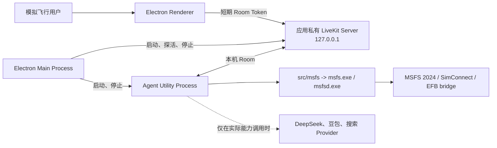
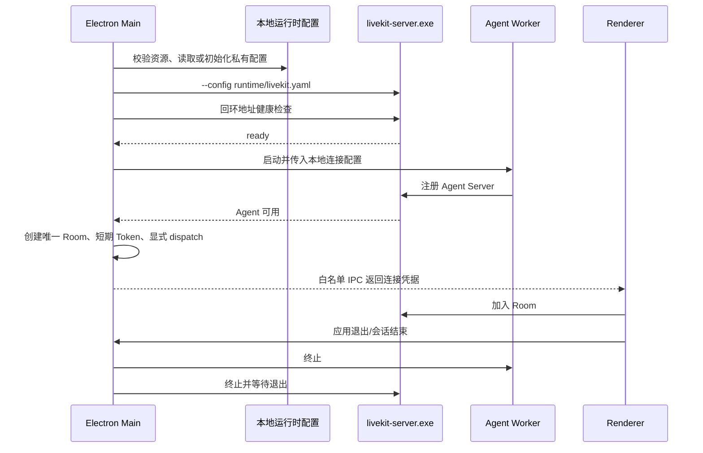

# 本地 LiveKit 运行时架构

**最后更新：** 2026-07-25
**状态：** 设计已接受，待实现

本文描述最终 Windows 安装包内的单机实时运行方式。它是 ADR-009 与 Spec-011 的架构说明，不表示当前项目已具备安装包或内置 LiveKit Server。

## 边界

以下组件始终留在本机：Electron 窗口、LiveKit Server、Agent Worker、MSFS CLI/daemon、SimConnect 和 EFB bridge。网络 Provider 不是本地运行时的一部分；启用它们时，音频、文字或经工具选择后的数据会按对应 Provider 协议离开设备。

## 生命周期

运行时的实际状态必须由主进程保存，不以 Renderer 推断为准。UI 只能获得脱敏的 `checking`、`worker_starting`、`ready`、`error` 等就绪状态和可执行的重试动作。

## 与开发态的区别

| 事项           | 开发态                                                     | 安装态                                         |
| -------------- | ---------------------------------------------------------- | ---------------------------------------------- |
| LiveKit Server | 从 `resources/livekit/livekit-server.exe` 手动运行 `--dev` | 应用携带固定版本二进制，由主进程以私有配置启动 |
| API Key/Secret | `.env` 中的开发值                                          | 首次初始化生成的每实例值，Renderer 不可读取    |
| 地址           | 可连接开发者指定的本机或测试地址                           | 仅 `127.0.0.1`，不可回退公网                   |
| Agent Worker   | `tsx` / 本地源码调试                                       | 随应用构建资源运行，由主进程管理               |
| 日志           | 开发者终端                                                 | 用户数据目录中的脱敏诊断日志                   |

开发态和安装态均使用官方 Windows Server 二进制，不使用 Docker、全局安装或远程 LiveKit 服务。`--dev` 的固定凭据仅用于开发态，不能作为安装态实现。官方 Server 的生产配置使用 `--config`；本项目只采用其中的配置管理方式，不把公网域名、TLS、TURN 或 Redis 当作回环单机运行的必需依赖。

## 安全模型

- Renderer 是低权限客户端：仅收到已签发、短期且权限最小的参与者 Token。
- Electron 主进程是本地可信编排器：负责配置、子进程和 Token 签发；只接受已校验的 IPC。
- Agent Worker 只获运行本次会话所需的配置；不得将 Secret 回传 Renderer。
- LiveKit Server 仅接收同机回环连接，不承担互联网认证或多人隔离服务。
- 本机 API Secret 不是对设备所有者的防护承诺；它用于防止不可信 Renderer 与远程网页获得签发能力。
- 安装包不得内置供应商 API Key。用户密钥与未来账号/订阅模式必须独立设计。

## 官方文档映射

| 项目设计点          | 官方依据                                                                                      | 本项目采纳方式                                          |
| ------------------- | --------------------------------------------------------------------------------------------- | ------------------------------------------------------- |
| Windows 本地 Server | [Running LiveKit locally](https://docs.livekit.io/transport/self-hosting/local/)              | 使用 Windows 二进制；不把开发模式带入发行态。           |
| Server 配置文件     | [Deploying LiveKit](https://docs.livekit.io/transport/self-hosting/deployment/)               | 使用 `--config` 管理私有回环配置。                      |
| 客户端不签发 Token  | [Endpoint token generation](https://docs.livekit.io/frontends/build/authentication/endpoint/) | 主进程保留 API Secret；Renderer 只取短期 Token。        |
| 显式 Agent dispatch | [Agent dispatch](https://docs.livekit.io/agents/server/agent-dispatch/)                       | 每次唯一 Room 在 Token 中指定 Agent；不自动 dispatch。  |
| Agent 生命周期      | [Server lifecycle](https://docs.livekit.io/agents/server/lifecycle/)                          | 等 Worker 注册再开放 Room；将启动、崩溃与退出纳入诊断。 |

## 实施顺序

1. 固定并审查 Windows LiveKit Server 发行版本、许可证与 SHA-256 来源。
2. 实现本地资源暂存、manifest 校验和安装包携带规则。
3. 实现主进程 `LocalLiveKitRuntime`、回环配置生成、探活、日志与清理。
4. 将现有 `AgentRuntime`、Readiness 与 Session Token 装配改为区分开发态/安装态连接来源。
5. 加入端口占用、退出清理、凭据不泄漏和 Token/dispatch 的自动化测试。
6. 在无开发依赖的干净 Windows 环境和真实 MSFS 2024 场景完成验收。
