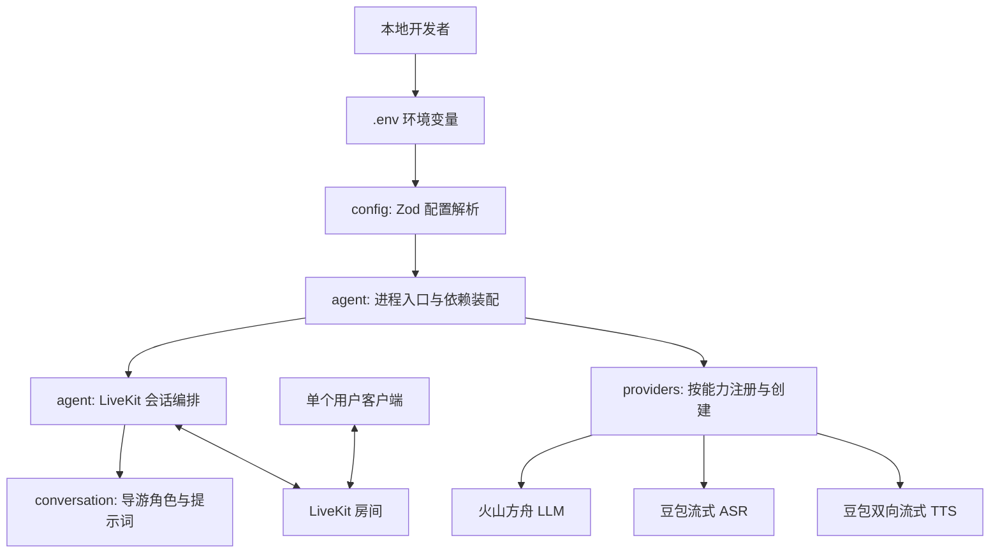
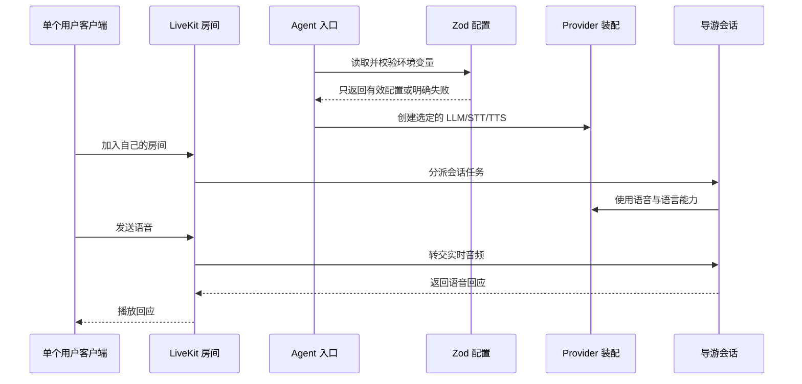

# 架构概览

**最后更新：** 2026-07-15  
**阶段：** 第一版设计

## 架构目标

第一版以本地可运行、单用户实时语音对话为唯一交付目标。结构上将 SDK 生命周期、会话角色、运行时配置和语音模型 Provider 分离，使后续增加工具、CLI（命令行工具）、客户端或替换模型时不必重写 Agent 入口。

这里的分层是职责边界，不是额外的运行时框架：第一版保持少量文件和直接依赖装配。

## 分层架构

## 核心业务流程

## 模块职责与依赖方向

| 模块 | 职责 | 可以依赖 | 不应依赖 |
|---|---|---|---|
| `src/config/` | 定义与解析 Zod 环境配置 | Zod、Node 环境 | Agent、Provider、业务模块 |
| `src/providers/` | 通过 `registry.ts` 注册并创建火山 LLM/STT/TTS | Provider 官方 SDK、配置 | LiveKit 房间生命周期、提示词 |
| `src/core/` | 启动辅助、脱敏日志与 Provider 自检 | 配置、注册表 | 提示词、音频协议细节 |
| `src/conversation/` | 定义导游身份、语言、回答边界 | 少量共享类型 | 环境变量、SDK 启动细节 |
| `src/agent/` | 连接 LiveKit、创建会话、组合依赖 | 上述内部模块、LiveKit Agents | 具体密钥解析、长篇提示词、未来业务逻辑 |
| `src/tools/`（未来） | 真实业务能力及其 Zod 参数 | 业务服务、共享类型 | Agent 生命周期实现 |
| `src/cli/`（未来） | 本地命令的参数与执行入口 | 需要调用的内部模块 | 复制 Agent 业务逻辑 |

依赖始终由入口向内组合；`config`、`conversation` 和未来的 `tools` 不反向导入 `agent`，从而避免循环依赖。

## LiveKit 集成准则

- 只在 `src/agent/`（以及必要的 `src/providers/` 适配代码）接触 LiveKit Agents SDK。
- 进程入口、worker/dispatcher 和会话创建按照当前安装版本的官方文档实现；实现前在 `node_modules` 中核对导出的 TypeScript 类型。
- 使用 LiveKit 已有的房间、音频发布订阅、会话及中断机制；不自行实现 WebSocket 信令、音频流协议或 VAD（语音活动检测）替代品。
- 每名用户使用独立 LiveKit 房间，Agent 只服务该房间上下文。房间命名、鉴权 Token 和客户端创建不属于第一版 Agent 仓库的实现范围，但需在联调前确定。

## Provider 注册与火山引擎边界

第一版固定使用火山引擎，并遵循参考项目 `Pipecat-AI` 的按能力注册方式：`src/providers/registry.ts` 是创建 LLM、STT、TTS 的唯一入口。它只注册 `volcengine`，不实现动态插件系统。

- 火山方舟 LLM 优先使用当前 LiveKit OpenAI 兼容插件的 `baseURL` 能力；安装后必须以本地类型为准。
- 豆包 STT、TTS 先核对当前 LiveKit 官方插件是否已支持；若无，最小 WebSocket 适配代码仅位于对应 Provider 子目录。
- 新供应商必须新增同类型工厂并注册，不能让 Agent 入口产生 `if/else` 供应商分支。

详细配置与实施顺序见 [火山引擎 Provider 集成设计](volcengine-integration.md)。

## 配置与密钥

`src/config/` 以 Zod Schema 集中校验配置。配置分为：LiveKit 连接参数、火山方舟 LLM、豆包 STT、豆包 TTS 与可选运行参数。STT 支持 Speech API Key 优先、App ID + Access Token 后备的互斥/成对校验。应用启动时一次性解析；缺失或不合法时以可读错误退出，禁止以空字符串继续运行。

真实密钥只来自运行环境或未提交的 `.env` 文件。`.env.example` 仅列出变量名和安全的示例值。禁止在源码、测试快照、日志、文档或 Git 历史中写入密钥。

## 外部依赖

| 依赖类别 | 用途 | 接入模块 | 选型状态 |
|---|---|---|---|
| LiveKit Agents Node.js SDK | 实时语音 Agent 生命周期与会话 | `src/agent/` | 实施时安装当前稳定版 |
| LiveKit Server / Cloud | 本地联调房间基础设施 | 本地运行环境 | 待确定 |
| 火山方舟 | 对话理解与生成（LLM） | `src/providers/llm/` | 第一版确定 |
| 豆包流式 ASR | 语音转文字（STT） | `src/providers/stt/` | 第一版确定 |
| 豆包双向流式 TTS | 文字转语音（TTS） | `src/providers/tts/` | 第一版确定 |
| Zod | 配置和未来工具参数校验 | `src/config/`、`src/tools/` | 已确定 |
| Vitest | 自动化测试 | `tests/` | 已确定 |

## 不变量（来自 ADR）

- LiveKit SDK API 必须在实施时依据当前官方文档与已安装类型定义核验。
- Agent 生命周期、Provider 创建、导游策略和配置解析必须分离。
- Provider 必须按 LLM/STT/TTS 分类，经 `registry.ts` 创建；火山协议细节不可出现在 Agent 入口。
- 所有配置与未来工具输入均须由 Zod 在边界处校验。
- 第一版仅做单用户独立房间的本地纯语音对话，不扩展模拟器数据或业务工具。
