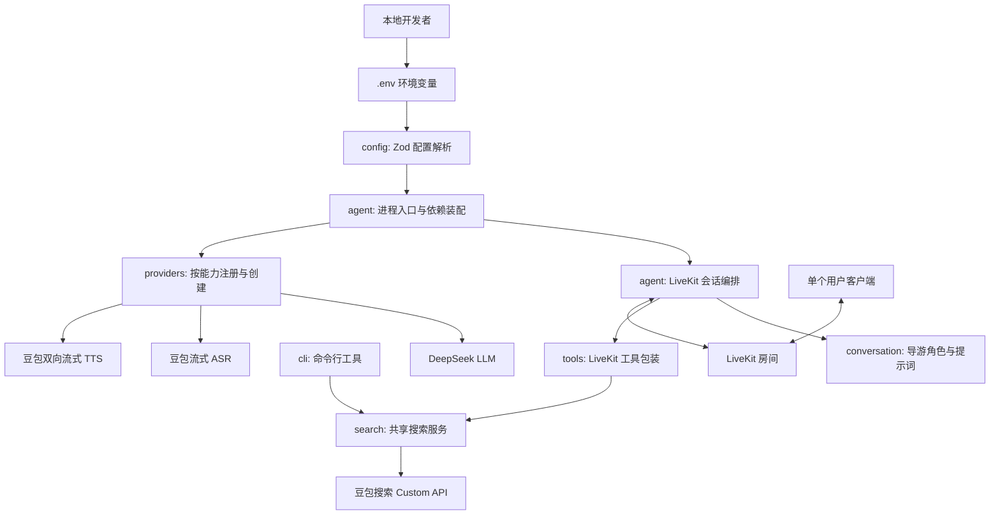
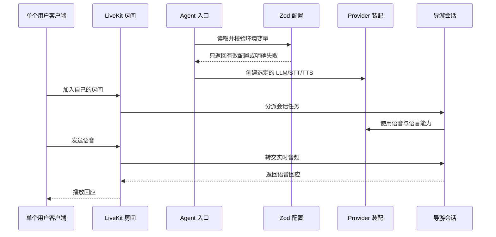
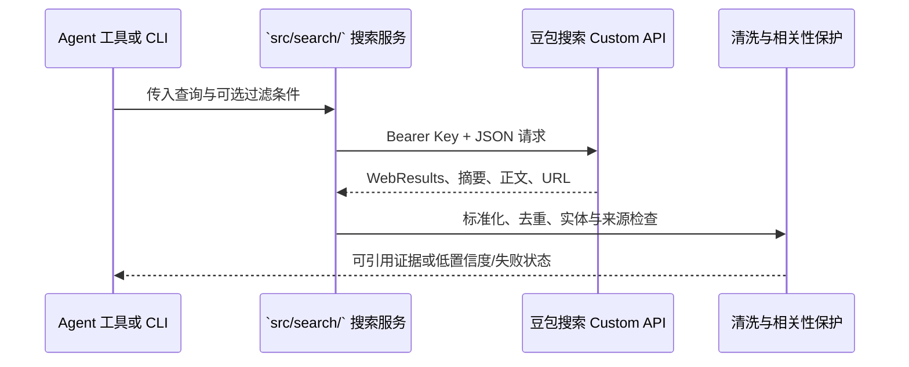

# 架构概览

**最后更新：** 2026-07-15  
**阶段：** 第一版语音闭环已完成；网络搜索规划中

## 架构目标

第一版以本地可运行、单用户实时语音对话为交付基线。下一阶段增加网络搜索，但仍保持 SDK 生命周期、会话角色、运行时配置、共享业务服务和语音模型 Provider 分离，使后续增加 CLI（命令行工具）或其他工具入口时不必重写 Agent。

这里的分层是职责边界，不是额外的运行时框架：第一版保持少量文件和直接依赖装配。

## 分层架构

## 核心业务流程

网络搜索的共享流程如下；CLI 与 Agent 使用相同的 `search` 服务，不互相启动进程。

## 模块职责与依赖方向

| 模块                  | 职责                                                      | 可以依赖                     | 不应依赖                               |
| --------------------- | --------------------------------------------------------- | ---------------------------- | -------------------------------------- |
| `src/config/`         | 定义与解析 Zod 环境配置                                   | Zod、Node 环境               | Agent、Provider、业务模块              |
| `src/providers/`      | 通过 `registry.ts` 注册并创建 DeepSeek LLM 与豆包 STT/TTS | Provider 官方 SDK、配置      | LiveKit 房间生命周期、提示词           |
| `src/core/`           | 启动辅助、脱敏日志与 Provider 自检                        | 配置、注册表                 | 提示词、音频协议细节                   |
| `src/conversation/`   | 定义导游身份、语言、回答边界                              | 少量共享类型                 | 环境变量、SDK 启动细节                 |
| `src/agent/`          | 连接 LiveKit、创建会话、组合依赖                          | 上述内部模块、LiveKit Agents | 具体密钥解析、长篇提示词、未来业务逻辑 |
| `src/search/`（规划） | 搜索 API 请求、结果标准化、来源与相关性保护               | Zod、HTTP、共享类型          | LiveKit 生命周期、CLI 参数解析         |
| `src/tools/`（规划）  | 将共享业务能力包装为 LiveKit 工具及其 Zod 参数            | 业务服务、LiveKit、共享类型  | 复制搜索协议、直接解析环境变量         |
| `src/cli/`（规划）    | 本地命令的参数、输出格式与退出码                          | 共享业务服务                 | 复制 Agent 或搜索业务逻辑              |

依赖始终由入口向内组合；`config`、`conversation` 和未来的 `tools` 不反向导入 `agent`，从而避免循环依赖。

## LiveKit 集成准则

- 只在 `src/agent/`（以及必要的 `src/providers/` 适配代码）接触 LiveKit Agents SDK。
- 进程入口、worker/dispatcher 和会话创建按照当前安装版本的官方文档实现；实现前在 `node_modules` 中核对导出的 TypeScript 类型。
- 使用 LiveKit 已有的房间、音频发布订阅、会话及中断机制；不自行实现 WebSocket 信令、音频流协议或 VAD（语音活动检测）替代品。
- 业务工具使用当前安装版本支持的 `llm.tool()`（函数工具）或等价官方 API；实现前必须核对官方文档与本地类型定义。
- 搜索 API 不属于 LLM/STT/TTS Provider，不进入 `src/providers/registry.ts`；它通过共享搜索服务被 Agent 工具调用。
- 每名用户使用独立 LiveKit 房间，Agent 只服务该房间上下文。房间命名、鉴权 Token 和客户端创建不属于第一版 Agent 仓库的实现范围，但需在联调前确定。

## Provider 注册与火山引擎边界

当前版本使用 DeepSeek LLM 与豆包语音，并遵循参考项目 `Pipecat-AI` 的按能力注册方式：`src/providers/registry.ts` 是创建 LLM、STT、TTS 的唯一入口。搜索 API 是独立业务依赖，不作为 Provider 注册，也不引入运行时 Provider 切换。

- DeepSeek LLM 使用当前 LiveKit OpenAI 插件的 `withDeepSeek()`（创建 DeepSeek LLM）能力；安装后必须以本地类型为准。
- 豆包 STT、TTS 先核对当前 LiveKit 官方插件是否已支持；若无，最小 WebSocket 适配代码仅位于对应 Provider 子目录。
- 新供应商必须新增同类型工厂并注册，不能让 Agent 入口产生 `if/else` 供应商分支。

详细配置与实施顺序见 [火山引擎 Provider 集成设计](volcengine-integration.md)。

## 配置与密钥

`src/config/` 以 Zod Schema 集中校验配置。当前配置包括 LiveKit 连接参数、DeepSeek LLM、豆包 STT、豆包 TTS 与可选运行参数；搜索功能启用后增加可选的 `VOLCENGINE_SEARCH_API_KEY`，并禁止业务模块直接读取环境变量。STT 支持 Speech API Key 优先、App ID + Access Token 后备的互斥/成对校验。应用启动时一次性解析；缺失或不合法时以可读错误退出，禁止以空字符串继续运行。

真实密钥只来自运行环境或未提交的 `.env` 文件。`.env.example` 仅列出变量名和安全的示例值。禁止在源码、测试快照、日志、文档或 Git 历史中写入密钥。

## 外部依赖

| 依赖类别                   | 用途                          | 接入模块                    | 选型状态             |
| -------------------------- | ----------------------------- | --------------------------- | -------------------- |
| LiveKit Agents Node.js SDK | 实时语音 Agent 生命周期与会话 | `src/agent/`                | 实施时安装当前稳定版 |
| LiveKit Server / Cloud     | 本地联调房间基础设施          | 本地运行环境                | 待确定               |
| DeepSeek                   | 对话理解与生成（LLM）         | `src/providers/llm/`        | 当前基线             |
| 豆包流式 ASR               | 语音转文字（STT）             | `src/providers/stt/`        | 第一版确定           |
| 豆包双向流式 TTS           | 文字转语音（TTS）             | `src/providers/tts/`        | 第一版确定           |
| 豆包搜索 Custom API        | 网络检索候选资料              | `src/search/`               | Spec-003 规划中      |
| Zod                        | 配置和未来工具参数校验        | `src/config/`、`src/tools/` | 已确定               |
| Vitest                     | 自动化测试                    | `tests/`                    | 已确定               |

## 不变量（来自 ADR）

- LiveKit SDK API 必须在实施时依据当前官方文档与已安装类型定义核验。
- Agent 生命周期、Provider 创建、导游策略和配置解析必须分离。
- Provider 必须按 LLM/STT/TTS 分类，经 `registry.ts` 创建；火山协议细节不可出现在 Agent 入口。
- 所有配置与未来工具输入均须由 Zod 在边界处校验。
- Spec-001 的单用户本地纯语音基线保持不变；网络搜索扩展必须遵循 Spec-003，不得借此扩展到模拟器遥测或其他未规划业务工具。
