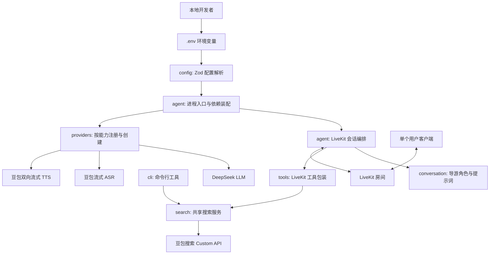
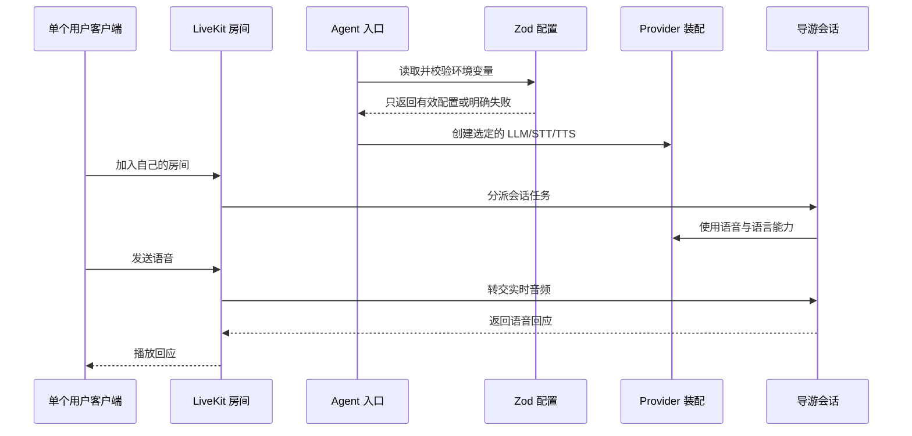
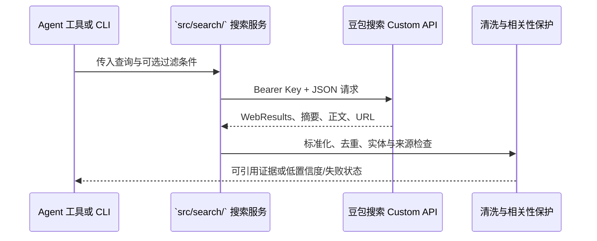
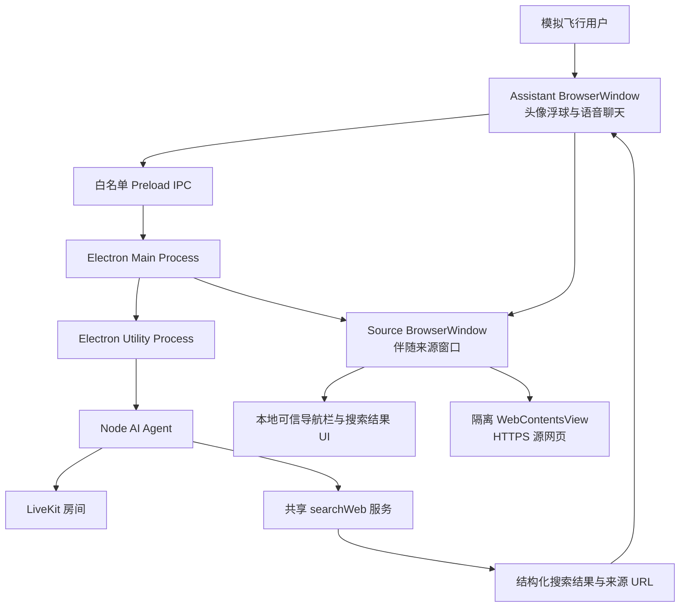
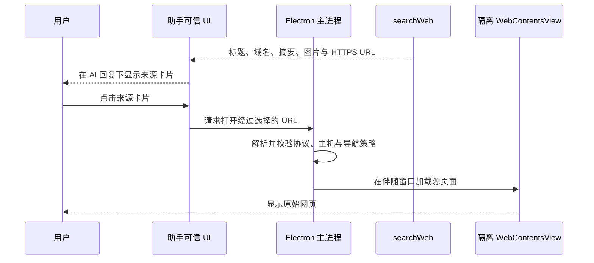

# 架构概览

**最后更新：** 2026-07-25

**阶段：** 第一版语音与文字闭环、网络搜索、7 个只读 MSFS 工具、Electron Room 客户端与启动诊断已实现；真实模拟器冒烟与正式安装包待完成

## 架构目标

当前版本以本地可运行、单用户实时语音与文字对话为交付基线，并已增加通用网络搜索。SDK 生命周期、会话角色、运行时配置、共享业务服务和语音模型 Provider 保持分离，使 CLI（命令行工具）与 Agent 可以复用同一搜索实现。

现有 Agent 外已增加 Windows Electron 桌面壳。桌面端是客户端与窗口编排层，不反向改变 Agent、Provider 或共享搜索服务的职责。当前仓库中的 `desktop/` 是桌面实现入口；`prototypes/` 只保留早期界面与窗口交互参考，不是生产运行入口。

这里的分层是职责边界，不是额外的运行时框架：第一版保持少量文件和直接依赖装配。

## 分层架构

## 核心业务流程

网络搜索的共享流程如下；CLI 与 Agent 使用相同的 `search` 服务，不互相启动进程。

## 桌面端边界

桌面端采用两个视觉窗口：常驻的语音与文字聊天窗口，以及按需出现的伴随来源浏览窗。Electron 主进程负责透明置顶窗口、多显示器定位、来源窗安全策略、短期 Token 和窗口状态保存；独立 Utility Process 自动运行 Agent Worker。可信 Renderer 通过 `@livekit/components-react` 的 Session（会话）模型连接唯一 LiveKit Room，发布并复用麦克风音轨，通过 `useSessionMessages().send()` 发送文字，播放远端回答，并接收文字消息、真实转写、Agent 状态和搜索来源。Agent 回答由成熟 Markdown 解析器渲染，消息滚动只在用户仍跟随底部时自动推进。

职责划分：

| 桌面模块                            | 职责                                                          | 安全边界                                                             |
| ----------------------------------- | ------------------------------------------------------------- | -------------------------------------------------------------------- |
| Electron Main Process（主进程）     | 窗口编排、短期 Token、配置诊断、Worker 生命周期和状态持久化   | 校验 IPC 与 URL；API Secret 不进入 Renderer                          |
| Assistant BrowserWindow（助手窗口） | Room 连接、聊天气泡、麦克风发布、回答播放、实时状态与来源卡片 | 只加载应用本地可信 UI；只持有短期参与者 Token                        |
| Agent Utility Process               | 启动/停止 LiveKit Worker，并隔离其进程池                      | 不阻塞 Electron 主进程；错误通过脱敏 Readiness DTO 返回              |
| Source BrowserWindow（来源窗口）    | 域名、关闭、拉伸及默认伴随助手窗口                            | 本地窗口框架与第三方网页内容分离；手动移动后本次打开期间保持自由位置 |
| WebContentsView（隔离网页视图）     | 加载用户选择的 HTTPS 百科或其他源页面                         | 禁用 Node 集成；开启上下文隔离与沙箱；拒绝权限和任意新窗口           |
| Node AI Agent                       | LiveKit、LLM、STT、TTS 和 `searchWeb` 工具编排                | 不依赖桌面 Renderer；继续复用现有配置与搜索边界                      |

MSFS 数据由 Agent 中的 `src/msfs/` 适配层调用随应用分发的 `msfs.exe` / `msfsd.exe`，并且只通过真实 MSFS 2024 的 SimConnect 获取。桌面 Renderer 不直接运行 CLI；模拟器不可用时，Agent 返回脱敏不可用状态而不生成位置、航路或天气数据。

来源查看流程：

远程页面不能共享助手窗口的 Preload 或 IPC。正式实现使用当前 Electron 推荐的 `WebContentsView`，不使用已弃用的 `BrowserView`，也不把 `<webview>` 作为首选方案。来源网页使用真实内容区的响应式视口、默认 100% 缩放；详细交互、安全检查和验收条件见 [Spec-004](../specs/spec-004-web-frontend-and-source-preview.md) 与 [Spec-009](../specs/spec-009-source-window-responsive-layout.md)。

## 模块职责与依赖方向

| 模块                | 职责                                                      | 可以依赖                     | 不应依赖                               |
| ------------------- | --------------------------------------------------------- | ---------------------------- | -------------------------------------- |
| `src/config/`       | 定义与解析 Zod 环境配置                                   | Zod、Node 环境               | Agent、Provider、业务模块              |
| `src/providers/`    | 通过 `registry.ts` 注册并创建 DeepSeek LLM 与豆包 STT/TTS | Provider 官方 SDK、配置      | LiveKit 房间生命周期、提示词           |
| `src/core/`         | 启动辅助、脱敏日志与 Provider 自检                        | 配置、注册表                 | 提示词、音频协议细节                   |
| `src/conversation/` | 定义导游身份、语言、回答边界                              | 少量共享类型                 | 环境变量、SDK 启动细节                 |
| `src/agent/`        | 连接 LiveKit、创建会话、组合依赖                          | 上述内部模块、LiveKit Agents | 具体密钥解析、长篇提示词、未来业务逻辑 |
| `src/search/`       | 搜索 API 请求、结果标准化、来源与相关性保护               | Zod、HTTP、共享类型          | LiveKit 生命周期、CLI 参数解析         |
| `src/tools/`        | 将共享业务能力包装为 LiveKit 工具及其 Zod 参数            | 业务服务、LiveKit、共享类型  | 复制搜索协议、直接解析环境变量         |
| `src/msfs/`         | 原生 CLI 进程、JSON/NDJSON、领域模型、错误与轨迹缓存      | Node 进程、Zod、MSFS CLI     | LiveKit 会话、提示词、Renderer         |
| `src/cli/`          | 本地命令的参数、输出格式与退出码                          | 共享业务服务                 | 复制 Agent 或搜索业务逻辑              |

依赖始终由入口向内组合；`config`、`conversation` 和未来的 `tools` 不反向导入 `agent`，从而避免循环依赖。

## LiveKit 集成准则

- LiveKit Agents SDK 只在 `src/agent/`（以及必要的 `src/providers/` 适配代码）使用；桌面 Renderer 使用官方 `@livekit/components-react` 与浏览器侧 `livekit-client`，两者职责分离。
- Renderer 的连接、Agent 状态、文字发送与会话消息、麦克风切换和回答播放分别以官方 `useSession`、`useAgent`、`useSessionMessages`、`useTrackToggle` 与 `RoomAudioRenderer` 为唯一状态源；不得恢复自建 Room、文字协议或转写拼接 Hook。
- Agent 通过官方 RoomIO 默认开启的 `lk.chat` 文字输入接收键盘消息，并复用同一 `AgentSession`、LLM、工具、TTS 和会话历史；不得为文字输入新增第二套聊天后端。
- UI 的“语音挂断”是同一 Room 内的音频输入输出暂停，不是结束整个 Session。Renderer 先通过 `RoomAudioRenderer` 立即静音，再以官方 RPC 请求 Agent 调用 `input/output.setAudioEnabled()` 与 `AgentSession.interrupt()`；文字消息继续复用原 Room。
- 按住说话和连续对话复用同一个 Session、STT、消息和麦克风管线。按住说话使用 `manual`（手动轮次），连续对话用 `null` 恢复官方自动 Turn Detector；不得把保存的 detector 对象重新传入运行时 `updateOptions()`。
- VAD（语音活动检测）产生 speaking/listening 用户状态；Turn Detector 决定何时提交轮次；interruption（打断）决定 Agent 回答时是否让出。这三个概念不得在 UI 或 Agent 编排中混用。
- Renderer 不得持有 LiveKit API Key 或 API Secret。可信主进程签发权限最小、有效期短且显式分派 Agent 的参与者 Token。
- 进程入口、worker/dispatcher 和会话创建按照当前安装版本的官方文档实现；实现前在 `node_modules` 中核对导出的 TypeScript 类型。
- 使用 LiveKit 已有的房间、音频发布订阅、会话及中断机制；不自行实现 WebSocket 信令、音频流协议或 VAD（语音活动检测）替代品。
- 业务工具使用当前安装版本支持的 `llm.tool()`（函数工具）或等价官方 API；实现前必须核对官方文档与本地类型定义。
- 搜索 API 不属于 LLM/STT/TTS Provider，不进入 `src/providers/registry.ts`；它通过共享搜索服务被 Agent 工具调用。
- 每次桌面会话使用独立 LiveKit 房间，Agent 只服务该房间上下文；Renderer 通过官方 SDK 发布本地音轨并订阅远端音频。

## Provider 注册与火山引擎边界

当前版本使用 DeepSeek LLM 与豆包语音，并遵循参考项目 `Pipecat-AI` 的按能力注册方式：`src/providers/registry.ts` 是创建 LLM、STT、TTS 的唯一入口。搜索 API 是独立业务依赖，不作为 Provider 注册，也不引入运行时 Provider 切换。

- DeepSeek LLM 使用当前 LiveKit OpenAI 插件的 `withDeepSeek()`（创建 DeepSeek LLM）能力；安装后必须以本地类型为准。
- 豆包 STT、TTS 先核对当前 LiveKit 官方插件是否已支持；若无，最小 WebSocket 适配代码仅位于对应 Provider 子目录。
- 新供应商必须新增同类型工厂并注册，不能让 Agent 入口产生 `if/else` 供应商分支。

详细配置与实施顺序见 [火山引擎 Provider 集成设计](volcengine-integration.md)。

## 配置与密钥

`src/config/` 以 Zod Schema 集中校验配置。当前配置包括 LiveKit 连接参数、DeepSeek LLM、豆包 STT、豆包 TTS 与搜索配置。`VOLCENGINE_SEARCH_API_KEY` 对纯语音会话可选；存在时 Agent 注册 `searchWeb`，独立搜索 CLI 则要求该 Key。业务模块不得直接读取环境变量。STT 支持 Speech API Key 优先、App ID + Access Token 后备的互斥/成对校验。

真实密钥只来自运行环境或未提交的 `.env` 文件。`.env.example` 仅列出变量名和安全的示例值。禁止在源码、测试快照、日志、文档或 Git 历史中写入密钥。

## 外部依赖

| 依赖类别                    | 用途                                     | 接入模块                                 | 选型状态           |
| --------------------------- | ---------------------------------------- | ---------------------------------------- | ------------------ |
| LiveKit Agents Node.js SDK  | 实时语音 Agent 生命周期与会话            | `src/agent/`                             | 已实现并验证       |
| LiveKit JavaScript SDK      | 桌面 Room、麦克风与回答音频              | `desktop/renderer/`                      | 已实现             |
| LiveKit React Components    | 官方 Session、Agent 状态与消息 UI        | `desktop/renderer/`                      | 已实现并验证       |
| LiveKit Server / Cloud      | 本地联调房间基础设施                     | 本地运行环境                             | 本机 Server 已验证 |
| DeepSeek                    | 对话理解与生成（LLM）                    | `src/providers/llm/`                     | 当前基线           |
| 豆包流式 ASR                | 语音转文字（STT）                        | `src/providers/stt/`                     | 第一版确定         |
| 豆包双向流式 TTS            | 文字转语音（TTS）                        | `src/providers/tts/`                     | 第一版确定         |
| 豆包搜索 Custom API         | 通用公开网页外部信息检索                 | `src/search/`                            | Spec-003 已实现    |
| Zod                         | 配置、CLI 响应和工具参数校验             | `src/config/`、`src/msfs/`、`src/tools/` | 已实现             |
| 原生 MSFS CLI               | SimConnect、EFB 航路、设施和游戏环境读取 | `src/msfs/`                              | 已实现，待实机冒烟 |
| Vitest                      | 自动化测试                               | `tests/`                                 | 已确定             |
| Electron                    | 桌面壳、Utility Process、窗口 IPC        | `desktop/main/`                          | 已实现             |
| React + Vite                | 助手与来源窗口的本地可信 UI              | `desktop/renderer/`                      | 已实现             |
| react-markdown + remark-gfm | Agent Markdown 回答的安全 React 渲染     | `desktop/renderer/`                      | 已实现并验证       |
| WebContentsView             | 隔离显示第三方 HTTPS 源网页              | `desktop/main/`                          | 基础实现已完成     |

## 不变量（来自 ADR）

- LiveKit SDK API 必须在实施时依据当前官方文档与已安装类型定义核验。
- Agent 生命周期、Provider 创建、导游策略和配置解析必须分离。
- Provider 必须按 LLM/STT/TTS 分类，经 `registry.ts` 创建；火山协议细节不可出现在 Agent 入口。
- 所有配置与未来工具输入均须由 Zod 在边界处校验。
- Spec-001 的单用户本地语音基线保持不变；`searchWeb` 可查询公开网页中的天气、新闻等外部信息，但不得将其描述为模拟器遥测或专用数据 Provider。
- 原生 MSFS CLI 是唯一模拟器边界；只有 `src/msfs/` 可以启动 CLI、解析 JSON/NDJSON 或接触受控 SimVar，第一版工具集合不得包含写操作或 `--unsafe`。
