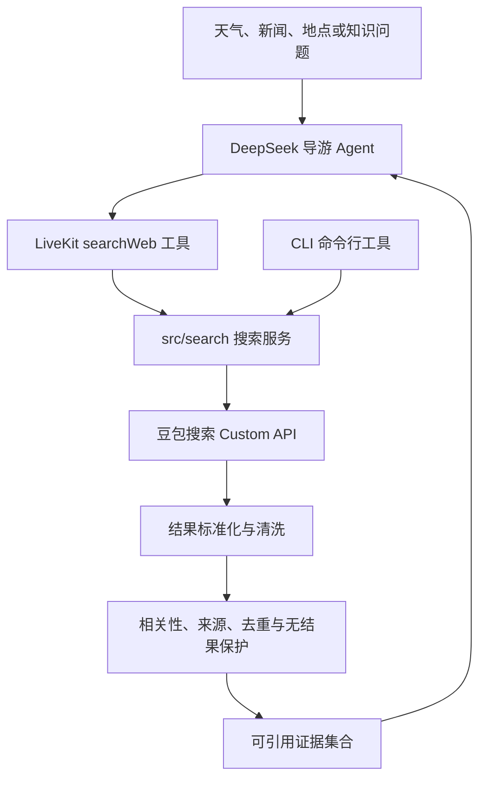

# Spec-003：网络搜索与可扩展能力模块

**日期：** 2026-07-15  
**最后更新：** 2026-07-16

**状态：** 已实现并完成真实接口与语音工具调用验证

## 背景

导游助手需要从模型外部获取公开网页信息，包括天气、新闻、活动、规则变化、人文地理、偏门地点、非亚洲地区和英文资料。豆包搜索 Custom 版的原始接口评测中，8 个检索用例有 6 个满足基础召回判定；指定站点主题不匹配和虚构地点误返回由项目相关性保护层拦截。因此接入不能停留在“请求 API 后把原文交给 LLM”。

当前项目的第一版语音闭环已经完成，搜索属于后续能力扩展，不修改已有 STT（语音转文字）、LLM 和 TTS（文字转语音）Provider 的职责。

## 需求边界

**包含：**

- 通过豆包搜索 Custom API 提供通用公开网页外部信息能力。
- 在 `src/search/` 实现与 LiveKit 无关的共享搜索服务。
- 对搜索结果进行 URL、摘要/正文、实体相关性、来源质量和去重处理。
- 对明显无关或不足以回答的问题返回“没有可靠资料”，禁止把无关结果当作答案依据。
- 在 `src/tools/` 将搜索服务包装为 LiveKit 自定义工具。
- 在 `src/cli/` 提供可复用同一搜索服务的 CLI（命令行工具）。
- 保留来源 URL、站点名称和必要的发布时间，供最终回答引用。
- 通过环境变量提供搜索 API Key，并纳入 Zod 配置校验。
- 为 API 失败、超时、空结果、低相关性和来源冲突提供可测试的异常路径。
- 支持天气、新闻等时效性查询，并向回答层保留来源地点、发布时间或更新时间；时间不明确时不得声称信息为实时。

**不包含：**

- 直接调用 CLI 子进程作为 Agent 的搜索实现。
- 第一阶段引入 MCP Server。
- 自动相信搜索服务返回的 `AuthInfoLevel`（来源权威等级）或搜索排名；项目必须维护自己的来源策略。
- 事实核验模型、第二个 LLM、多搜索供应商和自动回退。
- MSFS（Microsoft Flight Simulator）遥测、位置、高度、航向、航线或机场数据库。
- 专用天气 API、新闻 API 或其他结构化业务数据 Provider；这些信息当前通过公开网页搜索获取。
- Web、移动端、账号体系、云端部署和持久化搜索历史。

## 目标架构

“Skill（能力说明）”不作为独立运行时协议：行为规范放入 Agent instructions（提示词规则），可执行能力放入 LiveKit Toolset（工具集合）。搜索能力的共享实现仍由 `src/search/` 负责。

## 验收标准

- [x] 使用有效运行时 Key 时，搜索服务能调用 Custom API 并解析 `WebResults`。
- [x] 每条交给 Agent 的来源至少包含有效 URL，以及摘要或正文之一。
- [x] 普通有效查询至少保留两条实体相关来源；不足时返回低置信度状态。
- [x] 指定域名时，同时满足域名约束和主题实体相关性；仅满足域名不能判定通过。
- [x] 虚构地点或明显无结果查询不会把无关页面交给最终回答层。
- [x] 搜索结果中的 HTML 噪声、重复来源和过长正文会被清理或截断。
- [x] 关键来源优先使用政府、博物馆、大学、国际组织、官方文化遗产机构等项目来源策略。
- [x] CLI 与 LiveKit 工具调用同一个 `src/search/` 服务，不存在两套搜索逻辑。
- [x] CLI 支持 JSON 输出；认证失败、超时和低相关性使用非零退出码并且不泄露 Key。
- [x] 默认 `pnpm test` 不依赖真实搜索 Key；真实搜索只通过显式测试命令执行。
- [x] 天气等时效性查询保留来源时间；真实北京天气查询可优先返回政府或气象机构页面。
- [x] LiveKit 语音会话中，DeepSeek 能主动调用 `searchWeb`，再通过 TTS 播放基于工具结果的回答。

## 场景描述

**正常流程：**

1. 用户询问天气、新闻、活动、地点或知识主题。
2. Agent 调用 `searchWeb` 工具。
3. 搜索服务请求 Custom API，清洗并筛选结果。
4. Agent 将通过筛选的证据作为联网核实结果回答，并保留来源地点与时间。

**低质量结果流程：**

1. API 返回结果，但标题和正文不包含目标地点或主题实体。
2. 搜索服务将结果标记为低相关性。
3. Agent 说明后端未能联网确认；可以用自身已有知识作概括回答，但必须明确标注未经联网核实，必要时请求用户补充地点、名称或时间范围。

**接口异常流程：**

1. API 返回认证错误、超时或非 JSON 响应。
2. 搜索服务记录脱敏错误并返回可识别的失败状态。
3. Agent 告知用户暂时无法联网查询；可以提供明确标注为未联网核实的已有知识，但不得虚构搜索结果。

## 已完成的实施顺序

1. 新增搜索配置和 `src/search/` 共享服务，先实现请求、超时、错误和结果标准化。
2. 将已验证的测试用例迁移为脱敏的单元/集成测试，并保留显式真实 API 测试。
3. 实现来源白名单、实体相关性、去重和无结果保护。
4. 用 LiveKit 当前安装版本的 `llm.tool()` 注册 `searchWeb`，并更新导游提示词。
5. 实现复用同一服务的 CLI，提供人读模式和 JSON 模式。
6. 使用代表性人文地理、英文、虚构地点、指定站点和天气问题进行真实接口回归，并完成语音工具调用验证。

## 当前限制

- `searchWeb` 查询公开网页，不保证具备专用天气 API、新闻数据流或结构化数据库的实时性与完整性。
- 时效性回答必须结合 `publishTime` 或正文更新时间；无法确认时间时需要说明风险。
- 搜索证据可能较长，语音回答仍必须遵守两到四句话的口播约束；工具结果总长度与长回答体验后续继续优化。

## 相关测试

- `tests/unit/search/`：请求参数、结果标准化、实体相关性、来源策略、去重和无结果保护。
- `tests/integration/search-service.test.ts`：使用 mock HTTP 响应验证 API 错误、空结果和脏正文。
- `tests/e2e/search-api.smoke.test.ts`：显式运行的 8 组真实 Custom API 用例；默认测试无 Key 时跳过。
- `scripts/test-volcengine-search.mjs`：当前阶段的手动真实接口评测脚本。

真实搜索运行命令为 `pnpm search:smoke`；原始 API 候选结果评测命令为 `pnpm search:test`。

## 相关 ADR

- [ADR-001：以 LiveKit Agents 为实时语音边界](../adr/adr-001-livekit-agent-boundary.md)
- [ADR-003：Zod 边界校验与密钥管理](../adr/adr-003-zod-config-and-secrets.md)
- [ADR-005：DeepSeek 作为当前 LLM 基线](../adr/adr-005-deepseek-llm-baseline.md)
- [ADR-006：以搜索 API 为核心、CLI 为入口包装，暂缓 MCP](../adr/adr-006-search-access-boundary.md)

## 外部文档

- [豆包搜索 Custom 版文档](https://docs.volcengine.com/docs/87772/2272953?lang=zh)
- [LiveKit Agents 工具调用文档](https://docs.livekit.io/agents/logic/tools/definition/)
