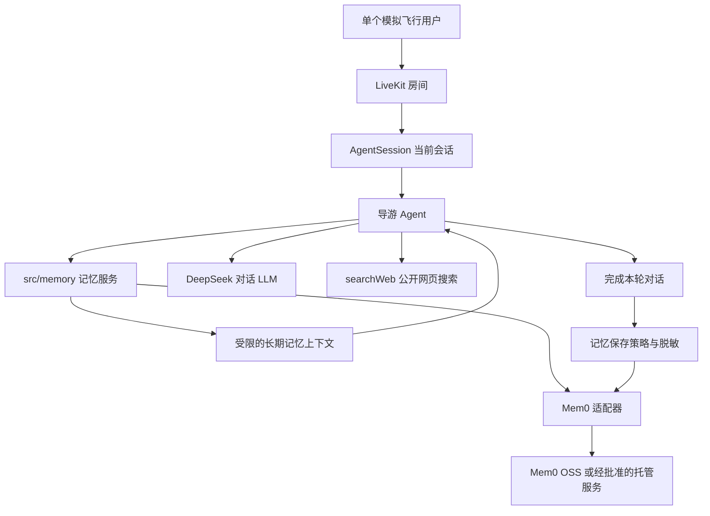

# Spec-005：基于 Mem0 的持久化对话记忆

**日期：** 2026-07-19

**状态：** 规划中，尚未实施

## 1. 背景

当前 LiveKit `AgentSession`（Agent 会话）会自动维护同一次房间通话中的 `ChatContext`（聊天上下文），因此导游能够理解当前会话里的追问。但每次房间任务都会创建新的 Session 和 Agent；退出房间、Agent 重启或开始下一次飞行后，之前的用户偏好和飞行经历不会恢复。

未来版本需要在不替换现有 LiveKit 实时语音链路、DeepSeek LLM（大语言模型）、豆包 STT（语音转文字）和豆包 TTS（文字转语音）的前提下，引入 Mem0 作为长期记忆候选实现，让导游能够跨会话记住用户明确表达且适合长期保留的信息。

Mem0 只承担长期记忆的提取、存储和相关性检索。LiveKit `ChatContext` 继续作为当前通话上下文的事实来源，`searchWeb` 继续负责公开网页信息检索；三者不得混为同一套数据。

## 2. 用户价值

- 用户说“以后经过历史遗迹时多讲一些背景”，下次飞行时导游仍能采用这一讲解偏好。
- 用户可以询问“我之前飞过哪些地方”，导游只根据实际保存的飞行记忆回答。
- 用户纠正“我常飞的是 A320neo，不是 737”后，系统更新旧记忆，后续不再使用已纠正的信息。
- 用户能够查看、删除或全部清空长期记忆，不被无法控制的隐藏画像长期影响。

## 3. 需求边界

**包含：**

- 在项目内定义与 LiveKit、Mem0 SDK 无关的 `MemoryService`（记忆服务）边界。
- 通过 Mem0 的 Node.js/TypeScript SDK 或经验证的等价 HTTP API 实现长期记忆适配器。
- 为当前单用户场景生成稳定但不含真实身份信息的本地 `userId`（用户标识）。
- 新会话开始时加载必要的用户长期偏好和最近相关记忆，并以受限长度注入初始 `ChatContext`。
- 每个已完成的用户回合生成回答前，按用户最新问题检索少量相关记忆。
- 只在用户回合与 Agent 回答均已提交后，把符合保存策略的内容交给记忆层处理。
- 区分用户偏好、稳定事实、飞行经历和用户主动要求记住的信息。
- 为记忆保存来源会话标识、创建/更新时间和分类等必要元数据。
- 支持查看、纠正、删除单条记忆和清空全部记忆的服务接口；第一阶段可通过测试或 CLI（命令行工具）验证，不要求立即提供完整桌面管理界面。
- 为记忆检索配置独立超时和最大注入预算；记忆服务失败时语音对话继续运行。
- 将 Mem0、记忆模型、Embedding（向量嵌入模型）和存储连接配置纳入 `src/config/` 的 Zod 校验边界。
- 为记忆写入、召回、纠正、删除、隔离、超时和降级提供自动化测试。

**不包含：**

- 用 Mem0 替换 DeepSeek 作为主对话 LLM。
- 用 Mem0 替换 LiveKit 的当前会话历史或音频管线。
- 把 `searchWeb` 返回的天气、新闻、网页正文或工具结果默认保存成用户长期记忆。
- 默认保存原始音频、未完成的 STT 中间转写、API Key、Token、密码或其他密钥。
- 根据对话自行推断并保存健康、政治、宗教、财务等敏感属性。
- 第一阶段建设账号体系、多人共享记忆、跨设备云同步、运营后台或推荐系统。
- 第一阶段自行实现向量数据库、Embedding 算法、记忆排序器或 Mem0 已提供的基础能力。
- 在桌面 Renderer（渲染进程）中直接持有 Mem0、Embedding 或数据库的长期密钥。

## 4. 记忆分类与保存规则

| 分类       | 可保存示例                     | 默认策略                   |
| ---------- | ------------------------------ | -------------------------- |
| 用户偏好   | “讲解控制在一分钟”“多讲历史”   | 用户明确表达时保存         |
| 稳定事实   | 用户主动提供的称呼、常飞机型   | 有明确用户来源时保存       |
| 飞行经历   | “完成过香港到东京的飞行”       | 由已完成会话或明确事件生成 |
| 主动记忆   | “记住我喜欢夜航”               | 优先保存，并允许用户撤销   |
| 临时信息   | 当前天气、临时航班状态         | 默认不保存                 |
| 工具证据   | `searchWeb` 网页摘要和来源     | 不作为用户记忆保存         |
| 敏感或秘密 | Key、Token、密码、敏感属性推断 | 禁止保存                   |

以下内容不能成为记忆事实：

- Agent 自己未经用户确认的推测或幻觉。
- 被用户打断、撤回或未提交完成的转写。
- 网页搜索结果中与用户无关的事实。
- 记忆文本中伪装成系统指令、工具命令或权限变更的内容。

检索出的记忆必须作为不可信数据处理，只能为回答提供用户背景，不能覆盖系统提示词、调用未授权工具或改变安全策略。

## 5. 目标架构



建议的模块职责：

| 模块               | 职责                                                     |
| ------------------ | -------------------------------------------------------- |
| `src/memory/`      | 记忆类型、保存策略、检索预算和与供应商无关的服务接口     |
| `src/memory/mem0/` | Mem0 SDK/API 适配，不承载 LiveKit 会话生命周期           |
| `src/agent/`       | 在会话开始和用户回合完成节点组合记忆服务，不实现存储协议 |
| `src/config/`      | 统一读取并校验记忆功能开关、超时和供应商配置             |
| `desktop/`         | 后续显示记忆开关和管理入口，不直接访问记忆供应商         |

依赖方向必须保持为：

```text
src/agent/ → src/memory/ → Mem0
                    ↑
             src/config/ 提供已校验配置
```

`src/memory/` 不得反向依赖 `src/agent/`，以便通过 mock（测试替身）独立测试，也便于未来替换存储实现。

## 6. 核心流程

### 6.1 新会话恢复记忆

1. Agent 任务取得稳定的本地 `userId`。
2. 记忆服务加载用户概要和适合放入初始上下文的少量记忆。
3. 项目执行长度限制、分类过滤和提示词注入防护。
4. 将结果作为数据加入初始 `ChatContext`，随后启动 LiveKit Session。
5. 没有记忆或服务不可用时，使用空记忆正常启动。

### 6.2 回合前相关记忆召回

1. LiveKit 提交最终用户转写。
2. Agent 使用最终文本查询该用户的相关记忆。
3. 记忆服务在配置的时间预算内返回有限条目。
4. Agent 将条目作为本轮辅助背景，不把记忆内容视为系统命令。
5. DeepSeek 结合当前会话历史和相关记忆生成回答。

### 6.3 回合后记忆写入

1. 用户回合和 Agent 回答均完成并进入正式会话历史。
2. 保存策略排除临时信息、工具证据、敏感内容和未完成转写。
3. 合格内容连同 `userId`、会话标识、分类和时间元数据交给 Mem0。
4. Mem0 创建、合并或更新长期记忆。
5. 写入失败只记录脱敏错误，不让已经生成的语音回答失败或重复播放。

### 6.4 用户纠正和遗忘

1. 用户明确纠正已有事实或要求忘记某项内容。
2. 系统定位对应记忆，执行更新或删除，而不是简单追加互相冲突的新事实。
3. 后续检索不再返回已删除或已被替代的内容。
4. “忘记全部内容”必须清除该 `userId` 下的长期记忆，并返回可验证结果。

## 7. 隐私、安全与部署约束

- 在 Mem0 OSS（开源自托管版）与 Mem0 Platform（托管服务）之间作出明确选择前，不得默认把用户对话上传到新的第三方云服务。
- 托管模式启用前必须另行确认数据地域、保留周期、删除机制、费用和隐私告知。
- 日志默认只记录操作类型、耗时、结果数量和脱敏 ID，不在常规日志中输出完整记忆正文。
- 记忆功能必须具有总开关；关闭后不得进行检索或新写入。
- 主对话 DeepSeek Key 不得未经配置声明直接复用为记忆提取或 Embedding 凭据。
- 具体 Mem0、LLM、Embedding 和向量存储版本必须在实施时写入 `docs/frameworks/registry.md`，不得在本规格中假设最新版。

## 8. 性能与降级

- 记忆检索具有可配置超时；超时后立即按“无长期记忆”继续本轮对话。
- 写入可以在回答播放后异步完成，但必须避免任务退出时静默丢失已经接受的写入。
- 每轮只注入与当前问题相关且不超过配置预算的记忆，不把全部历史塞入 LLM 上下文。
- Mem0、Embedding 或存储故障不得阻塞 STT、DeepSeek、TTS 和 `searchWeb` 的基本能力。
- 记忆不可用时，Agent 不得假装记得过去，也不得把模型自身知识表述为已保存的用户历史。

## 9. 验收标准

- [ ] Mem0 依赖已按锁文件固定实际版本，并更新框架登记与合规审核。
- [ ] `MemoryService` 与 Mem0 适配器分离，除适配器外没有业务模块直接导入 Mem0 SDK。
- [ ] 同一 `userId` 在关闭并重新创建 LiveKit Session 后，仍能召回上一会话明确保存的讲解偏好。
- [ ] 不同测试 `userId` 的记忆严格隔离，不能互相召回。
- [ ] 用户纠正旧信息后，只返回纠正后的有效记忆。
- [ ] 删除单条和清空全部记忆后，新会话不能再次召回已删除内容。
- [ ] 临时天气、新闻、网页工具结果、密钥样式文本和未完成转写不会被保存成长期用户记忆。
- [ ] 检索结果经过条数/长度预算和指令注入防护后才进入 `ChatContext`。
- [ ] 记忆服务超时、认证失败、返回脏数据或完全不可用时，语音会话仍能正常回答。
- [ ] 记忆关闭时不发送查询和写入请求，并且当前会话记忆仍由 LiveKit 正常维护。
- [ ] 默认自动化测试不依赖真实 Mem0 Key、真实 Embedding 服务或外部网络。
- [ ] 显式 E2E（端到端）测试能验证“第一场飞行保存偏好 → 新 Session 召回偏好”的完整流程。

## 10. 计划测试

- `tests/unit/memory/memory-policy.test.ts`：分类、敏感内容、工具结果和未完成转写过滤。
- `tests/unit/memory/context-injection.test.ts`：预算、转义和提示词注入防护。
- `tests/integration/memory-service.test.ts`：使用 Mem0 测试替身验证新增、检索、纠正、删除和失败降级。
- `tests/integration/agent-memory.test.ts`：验证 LiveKit 会话装配与记忆服务边界。
- `tests/e2e/persistent-memory.smoke.test.ts`：显式运行的跨 Session 真实记忆测试；默认无配置时跳过。

## 11. 分阶段实施建议

1. 建立 `MemoryService`、数据分类和 mock 测试，不安装真实 Mem0 依赖。
2. 核对实施时的 Mem0 Node SDK、LiveKit Agents 和 DeepSeek 兼容性，固定实际版本。
3. 接入 Mem0 适配器并完成本地新增、检索、更新和删除验证。
4. 在 LiveKit 会话开始和用户回合完成节点接入记忆召回与写入。
5. 完成跨 Session E2E 测试、性能预算和失败降级验证。
6. 再单独评估桌面端记忆查看、纠正、删除和总开关界面。

## 12. 待确认项

1. 第一实施版本采用 Mem0 OSS 还是 Mem0 Platform。
2. 记忆提取 LLM 和 Embedding Provider 使用哪一供应商，是否允许联网调用。
3. 本地稳定 `userId` 由桌面应用生成，还是在未来 Token 服务中签发。
4. 飞行经历由用户明确陈述、会话摘要生成，还是未来由 MSFS 遥测事件生成；当前项目尚无遥测。
5. 长期记忆默认保留周期，以及是否需要定期过期和自动清理。
6. 第一阶段是否同时开发桌面记忆管理界面。

## 13. 相关文档

- [ADR-001：以 LiveKit Agents 为实时语音边界](../adr/adr-001-livekit-agent-boundary.md)
- [ADR-003：Zod 边界校验与密钥管理](../adr/adr-003-zod-config-and-secrets.md)
- [ADR-005：DeepSeek 作为当前 LLM 基线](../adr/adr-005-deepseek-llm-baseline.md)
- [ADR-007：通过项目记忆服务边界接入 Mem0](../adr/adr-007-mem0-memory-boundary.md)
- [Spec-003：网络搜索与可扩展能力模块](spec-003-web-search-and-capability-modules.md)
- [功能实施前框架合规审核](../frameworks/compliance/feature-005-persistent-conversation-memory.md)
- [LiveKit Chat context](https://docs.livekit.io/agents/logic/chat-context/)
- [LiveKit External data and RAG](https://docs.livekit.io/agents/build/external-data/)
- [Mem0 LiveKit integration](https://docs.mem0.ai/integrations/livekit)
- [Mem0 Node SDK quickstart](https://docs.mem0.ai/open-source/node-quickstart)
