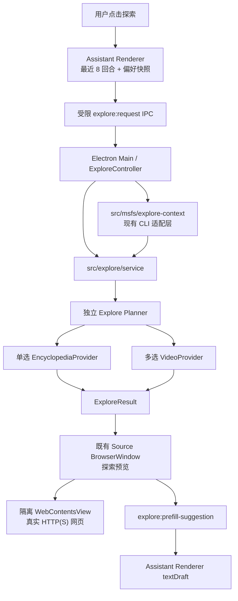

# Spec-015：用户触发的探索模式

**日期：** 2026-07-30<br />
**状态：** 已实现；人工未验收<br />
**前置决策：** [ADR-006](../adr/adr-006-search-access-boundary.md)、[ADR-008](../adr/adr-008-native-msfs-cli-agent-boundary.md)、[ADR-010](../adr/adr-010-secure-desktop-settings-global-ptt-and-diagnostics.md)<br />
**关联规格：** [Spec-007](spec-007-desktop-text-input.md)、[Spec-008](spec-008-native-msfs-cli-guide-tools.md)、[Spec-012](spec-012-desktop-settings-localization-global-ptt-and-diagnostics.md)、[Spec-014](spec-014-source-window-adaptive-reading-and-site-preferences.md)

## 目标

增加一项由用户主动发起的“探索”能力。用户在聊天面板点击“探索”后，应用以最近已提交的对话为主要线索，并在可用时以当前 MSFS 人文地理与航路信息增强，规划 2～3 个值得继续了解的主题；随后从用户已选择的百科与视频平台取得**真实**网页资源，展示为可浏览卡片，并提供 3 条可回填至文字输入框的接续问题。

探索模式是“发现与规划”，不是第二个导游 Agent，也不是现有 `searchWeb` 回答来源的另一种外观。它不得替换、写入或阻塞 LiveKit `AgentSession`，也不得让模型编造网页、视频或元数据。

## 1. 已确认的产品规则

1. 只有用户点击聊天面板的“探索”入口才可执行探索；每轮对话结束、飞机移动、窗口打开或应用启动均不得自动探索。
2. 最近对话是主要上下文。默认取最近最多 8 个已提交的用户/导游回合（最多 16 条有效消息），设置项可调低但不得超过该硬上限；不包含中间 STT 片段、来源网页正文或工具中间输出。
3. MSFS 是可选增强上下文。最近对话可用时，MSFS CLI、外部地理服务或地理补充失败都不得阻止探索；最近对话不可用而 MSFS 上下文可用时，允许进入 MSFS-only 降级模式；两者都不可用时才失败。
4. 每次成功规划只能产生 2～3 个主题和恰好 3 条完整的接续问题。接续问题点击后仅回填聊天文字输入框，用户编辑并主动发送后才调用既有 `useSessionMessages().send()`。
5. 再次点击时先检查对话变化：存在新增有效用户或导游消息，或最近主题明显变化，即重新规划并重新发现内容。仅在对话无变化时才比较可用的 MSFS 人文地理上下文。
6. 如果对话无变化，且 MSFS 不可用或无显著人文地理变化，直接恢复本桌面会话中上一次成功的 `ExploreResult`，不调用 Explore Planner 或内容 Provider。首次探索没有成功结果时正常执行。
7. 百科来源为单选：`Wikipedia`、`百度百科`、`抖音百科 / 快懂百科`。所选来源没有准确条目时不显示百科卡片，也不得偷偷切换其他百科。
8. 视频来源为多选：`YouTube`、`TikTok`、`抖音`；允许全部取消。单个平台失败不影响其他平台、百科或接续问题。
9. 卡片打开真实的 HTTP(S) 原网页。第一版不下载、转码、保存、重新托管或内嵌播放第三方视频。
10. 探索内容发现不得以持续付费调用量为前提；脆弱或非官方的平台发现实现必须可替换，并在实施前完成条款、稳定性和许可证 Spike。

## 2. 需求边界

### 2.1 包含

- 在现有 Assistant Renderer 的输入控制区增加本地化的“探索”按钮、进行中状态和可行动错误提示。
- 读取最近有效对话，向 Electron Main 发起受限的 `explore:request` IPC。
- 通过现有 `src/msfs/` 适配层获取飞行快照、已有的 CLI 地理上下文，以及可用的 EFB 航路摘要；只向 Planner 提供探索相关的精简字段。
- 独立的 Explore Planner 调用，以及百科、视频与网页发现 Provider 的编排、超时、取消、去重和部分失败处理。
- 复用现有 `Source BrowserWindow`、其本地可信 Renderer 和隔离 `WebContentsView`，新增探索结果预览状态。
- 在既有“通用”设置中增加探索来源设置；设置快照经 Zod 校验后随探索请求传给 Main。
- 单元、集成和人工烟测覆盖变化门控、降级、安全边界、来源窗口复用和文字回填。

### 2.2 不包含

- 自动探索、无限内容流、自动弹窗或因飞机移动打断用户。
- 将 Explore Planner 放进 `src/agent/`、`AgentSession`、LiveKit `ChatContext` 或长期记忆。
- 把探索结果伪装成 `guide.sources`，或关联到某条导游回答作为证据。
- 让模型生成、验证或选择真实 URL、视频 ID、条目 ID、作者、发布时间或缩略图。
- 绕过 CAPTCHA、登录、设备验证、频率限制，或自研抖音/TikTok 签名逆向。
- 在第一版要求新增 Nominatim / Overpass。现有 CLI 的 `external geo context` 已可作为首选人文地理输入；只有其信息不足且 Spike 通过时，才在后续阶段增加可选地理补充层。
- 改变现有 `searchWeb` 的豆包搜索边界或将其作为探索的默认通用发现服务；它是导游回答的既有服务，且不满足本功能“无持续付费调用量前提”的约束。

## 3. 与当前项目的适配

### 3.1 现有能力的复用

| 现有能力                                                                | 探索模式的使用方式                                                                                                      | 不得改变的边界                                                                                |
| ----------------------------------------------------------------------- | ----------------------------------------------------------------------------------------------------------------------- | --------------------------------------------------------------------------------------------- |
| `desktop/renderer/src/session-messages.ts`                              | 从 LiveKit `ReceivedMessage` 派生最近已提交的用户/导游消息；探索需使用独立的最多 8 回合截取，不受聊天气泡显示条数限制。 | 不采集空消息、临时转写、来源全文或未提交草稿。                                                |
| `desktop/renderer/src/main.tsx` 的 `textDraft` 与 `submitTextMessage()` | 接续问题只调用 `setTextComposerOpen(true)` 与 `setTextDraft(prompt)`，并聚焦输入框。                                    | 不调用 `sendText()`，不绕过用户确认。                                                         |
| `src/msfs/MsfsCliClient` 与 `MsfsGuideService`                          | 新的探索上下文 Provider 只组合 `getFlightSnapshot()`、`getLocationContext()`、`getRouteBrief()` 等现有高层结果。        | 只有 `src/msfs/` 可启动 CLI、解析 JSON/NDJSON 或接触 SimConnect；不新增直接 SimConnect 链路。 |
| `Source BrowserWindow`、`sourceWindowState` 与 `WebContentsView`        | 同一个窗口实例在“回答来源预览”与“探索预览”之间切换；卡片仍进入现有的受控远程页面加载流程。                              | 不复制窗口尺寸、伴随定位、多显示器、手动移动、缩放、阅读模式、预热、失败恢复或安全策略。      |
| `desktop/preload/index.ts`                                              | 以最小白名单新增探索请求、状态和建议回填桥接。                                                                          | Renderer 不获得 CLI、模型密钥、任意网页加载或任意 IPC 能力。                                  |
| `src/providers/llm/` 与 `src/config/`                                   | Explore Planner 的具体 DeepSeek 实现位于 Provider 层，凭据和模型配置仍由受校验配置提供。                                | 不在 Renderer 读取 `process.env`，不让 `src/agent/` 承载新业务编排。                          |

### 3.2 `guide.sources` 与探索协议分离

`shared/guide-events.ts` 的 `guide.sources` 仅表达 `searchWeb` 为某次导游回答获得的证据。探索必须新增独立共享契约，例如：

```text
shared/explore-contracts.ts
  exploreRequestSchema
  explorePreferencesSchema
  explorePlanSchema
  exploreResultSchema
  exploreErrorSchema
```

`SourceWindowState` 可演进为对 `GuideSourcesPreview` 与 `ExplorePreview` 的判别联合，或引入等价的 `CompanionPreview`。远程网页加载则接收从两种预览统一映射出的最小 `title / siteName / url` 资源引用。此演进只扩大预览数据模型；`guide.sources` 的消息格式、回答来源归属与现有来源卡片行为均保持不变。

### 3.3 设置落点

当前“通用”设置的非敏感偏好保存在 Assistant Renderer 的本地偏好中。第一版在同一受信任设置页增加“探索来源”分组：

```ts
type ExplorePreferences = {
  encyclopedia: 'wikipedia' | 'baidu_baike' | 'douyin_baike';
  videoPlatforms: Array<'youtube' | 'tiktok' | 'douyin'>;
};
```

- 百科默认值须在实施前由产品在 `wikipedia` 与 `baidu_baike` 中明确选择；无论界面语言，运行时必须只有一个百科默认值。视频的初始勾选组合也须在实施前明确并写入测试。
- 设置 UI 将百科呈现为单选、视频呈现为多选，保存时与现有通用偏好一起本地化持久化。
- Renderer 只能传递该偏好快照；Preload 和 Main 必须以同一 Zod Schema 再校验，Provider 选择逻辑只在 Main / 服务层发生。
- 探索设置不包含密钥、Cookie、搜索 URL 或任意域名；不得进入诊断包中的配置摘要。

## 4. 领域模型与不变量

### 4.1 Planner 输入与输出

```ts
type ExplorePlannerInput = {
  recentConversation?: Array<{ role: 'user' | 'assistant'; text: string }>;
  msfs?: MsfsExploreContext;
  preferences: ExplorePreferences;
  locale: 'zh-CN' | 'en-US';
};

type ExplorePlan = {
  topics: Array<{
    id: string;
    title: string; // 1..80
    reason: string; // 1..180
    encyclopediaQuery: string; // 1..120
    videoQuery: string; // 1..160
    alternateNames: string[]; // 最多 4 个
  }>;
  suggestedPrompts: [string, string, string]; // 每项 2..160
};
```

`topics` 长度必须为 2～3。Schema 和额外策略必须拒绝或剥离 Planner 输出中的 `url`、`videoId`、`pageId`、作者、发布时间和缩略图字段。调用 Planner 前必须保证 `recentConversation` 或 `msfs` 至少有一个有效值。

### 4.2 MSFS 探索上下文

`src/msfs/explore-context.ts`（建议新增）负责把现有高层结果缩减为稳定的 `MsfsExploreContext`。它不直接使用 CLI 参数：

```ts
type MsfsExploreContext = {
  capturedAt: string;
  position?: {
    latitude: number;
    longitude: number;
    altitudeMeters?: number;
    headingDegrees?: number;
  };
  place?: { country?: string; region?: string; city?: string; locality?: string };
  route?: { originIcao?: string; destinationIcao?: string; nextWaypointName?: string };
  nearby?: Array<{ name: string; category: string; distanceMeters?: number }>;
};
```

- 首选由已有 `getLocationContext()` 提供人文地理数据，并与 `getFlightSnapshot()`、`getRouteBrief()` 的必要字段合并；未知或未映射字段直接省略。
- 不传递速度、姿态、油量、完整航迹、请求 ID、时间戳以外的诊断字段，或与探索无关的飞机系统数据。
- CLI、地理上下文或航路任一调用失败只使相应部分缺失；只要对话有效，探索主路径仍正常运行。
- 后续如需 Nominatim / Overpass，只能作为 `src/geography/` 中可选、限流、缓存并具 attribution 的增强器；它失败不得丢弃已有 CLI 结果或对话主路径。

### 4.3 ExploreResult 与真实资源

`ExploreResult` 由 Planner 输出和 Provider 返回的可信资源组合而成。每张卡片至少包含经校验的 `kind`（`encyclopedia` 或 `video`）、`topicId`、`title`、`siteName` 与 `url`；缩略图、作者、发布时间只有 Provider 实际返回且校验通过时才可选加入。不可确认 URL 的结果必须丢弃。

模型不能补足空卡片。一个主题可没有百科卡片或没有视频卡片，但保留该主题和接续问题；结果可带去敏的 `unavailableProviders` 供 UI 显示“部分来源暂不可用”。

## 5. 上下文变化门控

每个桌面会话在 Electron Main 中保留最近一次**成功**探索的轻量快照与 `ExploreResult`。它不是长期记忆、跨会话缓存或分析日志；应用退出后清除。

```text
用户点击探索
  ├─ 首次或没有成功结果 → 执行探索
  ├─ 最近对话存在有效变化 → 执行探索
  ├─ 对话无变化且 MSFS 上下文显著变化 → 执行探索
  └─ 其他情况 → 仅打开上一次 ExploreResult
```

### 5.1 对话优先

对话快照以已提交消息的稳定 ID、角色和规范化文字建立指纹。上一次成功探索后出现新消息，或当前有限窗口的主题内容明显变化，即视为变化。只变更 UI 状态、消息时间、来源卡片或中间转写不触发探索。

### 5.2 MSFS 次级判定

仅在对话无变化且本次取得了有效 MSFS 上下文时检查。以下任一项变化才触发：国家、行政区、城市/聚居地、附近人文或自然地标、航路相关地点发生变化，或位置距上次成功快照超过配置阈值。第一版默认阈值为 10 km，并作为 Main 的非秘密常量集中定义，待实机 Spike 后才可调整。

原始经纬度小幅抖动、速度、航向、海拔、时间戳、请求 ID，以及“MSFS 从可用变为暂不可用”本身都不触发。MSFS 不可用时跳过该步骤，不把它当作错误或变化。

## 6. 服务划分与数据流

建议的新增模块如下；具体文件可以小范围合并，但依赖方向不得反转：

```text
shared/
  explore-contracts.ts              # Renderer / Preload / Main 的 Zod DTO
src/
  explore/
    service.ts                      # 无 Electron、无 LiveKit 的总编排
    planner.ts                      # ExplorePlanner 接口与提示词输入边界
    types.ts                        # 内部领域类型、变化快照
    encyclopedia/{service,provider,wikipedia,baidu-baike,douyin-baike}.ts
    video/{service,provider,youtube,tiktok,douyin}.ts
    discovery/{provider,duckduckgo}.ts
  msfs/
    explore-context.ts              # 复用 MsfsGuideService / MsfsCliClient 的薄适配
  providers/llm/
    deepseek-explore.ts             # 独立 ExplorePlanner 实现
desktop/main/
  explore-controller.ts             # IPC、单请求生命周期、窗口交接
```



`ExploreService` 不导入 Electron、LiveKit、`BrowserWindow` 或 Renderer 代码。Main 创建整次请求的 `AbortController`，同一桌面会话同时最多运行一个请求；按钮执行期间禁用。总预算目标为 10～15 秒，各 Planner、MSFS、发现和 Provider 请求有独立子超时，视频 Provider 必须并行。关闭探索窗口不影响 LiveKit 会话；用户取消或开始新的探索时中止未完成的网页请求。

## 7. Provider 约束与分阶段范围

所有 Provider 以小接口返回已发现的候选资源，并在服务层按 URL 规范化去重、域名允许列表和 Zod Schema 校验。一个 Provider 的异常必须被转换为部分失败，不能击穿其他 Provider。

| Provider  | 第一版策略                                                                             | 重要限制                                                          |
| --------- | -------------------------------------------------------------------------------------- | ----------------------------------------------------------------- |
| Wikipedia | Wikimedia 官方 API。                                                                   | 只返回与查询实体准确匹配的真实条目。                              |
| YouTube   | 先完成 `youtubei.js` 可用性与打包 Spike；通过后作为可替换 Provider 接入。              | 不使用必须付费的 YouTube Data Search 配额方案作为 V1 前提。       |
| 百度百科  | 代码构造 `https://baike.baidu.com/search/word?pic=1&sug=1&word=<query>` 站内搜索页。   | 只展示 AI 主题，不猜测具体词条；不请求或解析搜索页/词条正文。     |
| 抖音百科  | 代码构造 `https://www.baike.com/search?keyword=<query>&activeTab=DOC_TAB` 站内搜索页。 | 只展示 AI 主题，不猜测具体词条；不请求或解析搜索页/词条正文。     |
| TikTok    | 发现真实 URL 后优先请求官方 oEmbed 补充元数据。                                        | oEmbed 不成功时仅保留可验证标题、平台与 URL，或丢弃。             |
| 抖音      | 代码构造 `https://www.douyin.com/jingxuan/search/<query>?type=general` 站内搜索页。    | 只展示 AI 主题，不解析视频结果，不使用 `aid`、Cookie 或签名逆向。 |

在安装任何新依赖前，必须完成技术 Spike、登记准确版本/许可证/用途至 `docs/frameworks/registry.md`，并确认 Electron 主进程或 Utility Process 中的打包兼容性。无法稳定运行的 Provider 不得伪装为已支持的平台；可以在设置中暂时隐藏或标记实验性，待通过 Spike 再开放。

## 8. 界面与伴随窗口

### 8.1 Assistant Renderer

- “探索”位于现有聊天窗口的输入控制区，始终是显式动作；无可用上下文时点击后显示“当前没有可用于探索的对话或飞行上下文”。
- 执行中按钮禁用并显示本地化加载状态；取消、失败或完成后恢复可点击。探索运行不改变语音录入、TTS、Room 连接或主 Agent 状态。
- 成功后 Main 打开或更新现有来源浮窗。探索预览始终在该窗口中承载，不受“应用内打开回答来源”偏好影响；该偏好只继续控制既有回答来源入口。若本次命中变化门控的“无变化”分支，直接展示上次成功预览，UI 可不显示重新搜索动画。

### 8.2 探索预览

来源窗口的本地可信预览按主题展示标题、简短推荐理由、百科/视频卡片和“继续聊”区域。卡片点击仍走现有 `source:select` 等价的受控选择流程，随后由无 Node、开启 sandbox 与 context isolation 的 `WebContentsView` 打开真实页面。网页阅读模式、站点缩放、返回列表、加载、重试、外部浏览器打开和关闭逻辑完全沿用 Spec-014。

接续问题按钮不可自动发送：

```text
Explore Preview
  -> explore:prefill-suggestion(text)
  -> Main 验证长度与来源窗口发送者
  -> Assistant Renderer 事件
  -> 打开文字输入框、回填 textDraft、聚焦
  -> 用户编辑并按发送 / Enter
  -> 既有 submitTextMessage() -> useSessionMessages().send()
```

探索预览不得因为用户关闭来源窗而删除上次 `ExploreResult`；同会话的再次点击仍可恢复它。助手窗口收起时继续按现有生命周期关闭来源窗和销毁远程 `WebContentsView`。

## 9. 失败、隐私、安全与合规

- Planner 失败：显示“本次无法生成探索主题”，不调用内容 Provider；语音和文字会话不受影响。
- 对话可用而 MSFS 失败：正常进行对话驱动探索；不向用户显示为整体故障。
- 对话失败而 MSFS 可用：允许 MSFS-only 探索，并仅在内部状态记录该降级原因。
- 两类上下文都失败：不调用 Planner 或 Provider，显示无上下文提示。
- 所选百科无准确条目：隐藏该卡片，不切换来源。单个视频 Provider、元数据请求或地理补充失败：保留其他成功结果和建议问题。
- Planner 输出、IPC 输入、CLI 适配结果、Provider HTTP 响应、预览状态和回填文字均视为不可信数据，必须在各跨边界处使用 Zod 校验。错误消息必须脱敏，不包含密钥、Cookie、认证 Header、完整查询 URL 或第三方响应正文。
- URL 继续限定 `http:` / `https:`，并在 Main 的现有 `isSafeWebUrl`、导航白名单、新窗口拒绝和权限拒绝边界内加载。探索不得把第三方网页放进 Assistant Renderer、Preload 或任何 Node 权限上下文。
- 不默认上传网页正文、消息来源全文、Cookie、完整飞行轨迹或诊断信息给 Planner。诊断若记录探索事件，只可保存去敏的阶段、耗时、Provider 名称、结果计数与错误码；是否保留用户对话文本继续受既有诊断策略约束。

## 10. 测试与验收标准

### 10.1 自动化测试

建议新增或扩展以下测试：

```text
tests/unit/explore/contracts.test.ts
tests/unit/explore/planner-schema.test.ts
tests/unit/explore/service.test.ts
tests/unit/explore/context-change.test.ts
tests/unit/explore/encyclopedia.test.ts
tests/unit/explore/video.test.ts
tests/unit/explore/web-discovery.test.ts
tests/unit/msfs/explore-context.test.ts
tests/unit/desktop/explore-controller.test.ts
tests/unit/session-messages.test.ts
tests/unit/source-preview.test.ts
tests/integration/explore-companion-window.test.ts
```

重点覆盖：Planner 的 2～3 主题和 3 条建议约束；URL 字段拒绝；百科单选且不 fallback；视频多选并行和部分失败；真实 URL 的协议/域名校验与去重；对话成功 + MSFS 失败、MSFS 成功 + 对话失败、两者皆失败；对话优先变化门控；MSFS 轻微抖动不触发；无变化不发起网络；建议只回填草稿且不调用 `send()`；来源窗口的预览切换、远程网页安全加载、返回与重试不回归。

### 10.2 验收清单

- [ ] 未点击“探索”时，绝不发生 Explore Planner、百科或视频 Provider 请求。
- [ ] 首次点击在至少一种有效上下文下会调用 Planner 和已启用 Provider；一次最多 3 个主题、恰好 3 条接续问题。
- [ ] 后续点击先以最近对话变化决定是否重跑；只有对话无变化时，才使用可用 MSFS 人文地理显著变化作为第二条件。
- [ ] 上下文无变化时不调用 Planner 或 Provider，并恢复同会话的上一次 `ExploreResult`。
- [ ] MSFS 不可用不会阻断有效对话驱动的探索；对话不可用但 MSFS 有效时可降级；两者均不可用才失败。
- [ ] Explore Planner 与 LiveKit `AgentSession` 生命周期独立，不阻塞语音、TTS、文字发送或现有工具调用。
- [ ] 模型不能生成或控制任何真实资源 URL；所有卡片 URL 均来自经校验的 Provider。
- [ ] 百科是单选且未命中不 fallback；视频是多选且单平台失败不影响其他结果。
- [ ] 探索结果不使用 `guide.sources`，也不显示为某条导游回答的证据。
- [ ] 探索完整复用现有来源浮窗、伴随定位、跨屏与拉伸、真实视口、站点缩放/阅读模式、隔离 `WebContentsView` 与加载恢复。
- [ ] 点击接续问题只写入 Assistant Renderer 的文字草稿；用户编辑并主动发送后才进入既有 LiveKit 文本管线。
- [ ] 默认测试集不依赖真实第三方网络、登录 Cookie、付费 Key 或真实 MSFS；真实网络与实机验证仅作为显式烟测。
- [ ] 新依赖、精确版本、许可证、用途和官方/上游依据均已登记到 `docs/frameworks/registry.md`。

## 11. 实施阶段与前置 Spike

### Phase 0：契约与纵向 Mock

先实现共享 Zod 契约、变化门控、固定 Planner/Provider 测试替身、Assistant 探索入口、探索预览和文字回填。此阶段不接入真实网络，不改变 Agent Worker。

### Phase 1：稳定闭环

接入独立 DeepSeek Planner、现有 MSFS CLI 上下文适配、Wikipedia 官方 API 和已通过 Spike 的 YouTube Provider。完成无变化复用、超时、取消、来源窗切换与默认自动化测试。

### Phase 2：可替换的免费发现

根据 Spike 结果依次开放百度百科、抖音百科、TikTok 与抖音适配器；为通用发现增加域名过滤、元数据降级、限流和质量监控。只有 CLI 地理信息不足时再评估 OSM 补充层。

### Phase 3：可靠性与人工验收（待完成）

代码、单元测试和桌面构建已完成；尚未完成人工验收。在真实 LiveKit 会话、真实 MSFS 数据和中外网络环境下验证卡片质量、超时、Provider 退化、来源窗行为和“回填但不发送”。完成后更新本规格状态和测试记录。

实施前至少验证：`youtubei.js` 在 Electron 打包后能稳定返回真实视频数据；免费发现可得到指定平台的合法候选 URL；TikTok oEmbed 对真实 URL 的降级行为；现有 CLI `external geo context` 在多个城市的字段质量；以及所有调用在目标网络环境中的可达性。若任一结论不稳定，应保留接口并暂缓对应 Provider，不以模型伪造结果补偿。

## 12. 后续架构决策

正式进入 Phase 1 前，新增 ADR“探索规划与外部内容发现分离”，至少固定以下不变量：Explore Planner 不产生真实资源定位信息；Provider 可替换；探索与实时 Agent 分离；MSFS 只能经 `src/msfs/`；对话为主、MSFS 为可选增强；第三方网页只在既有隔离浏览边界中展示；无持续付费搜索依赖是当前产品要求。
