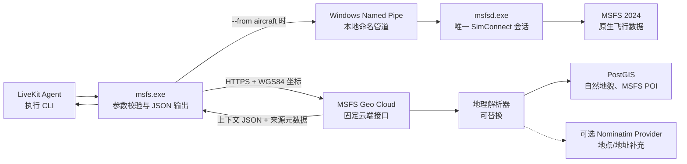
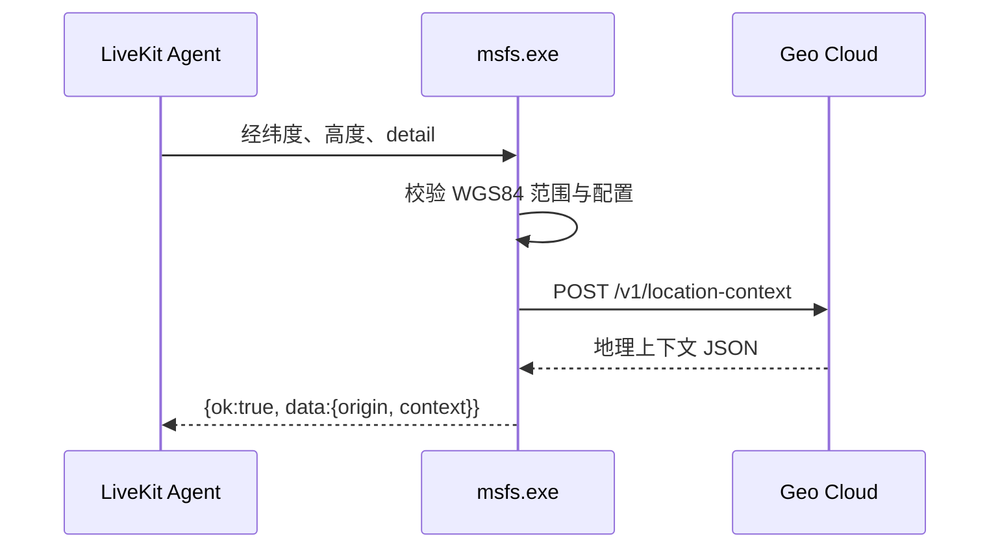
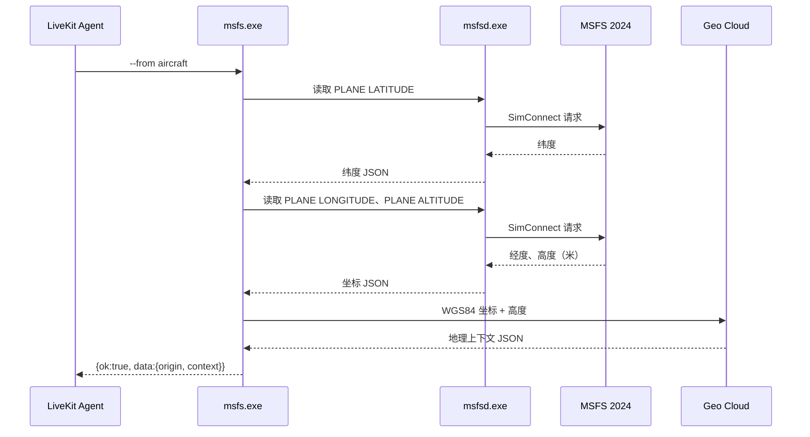
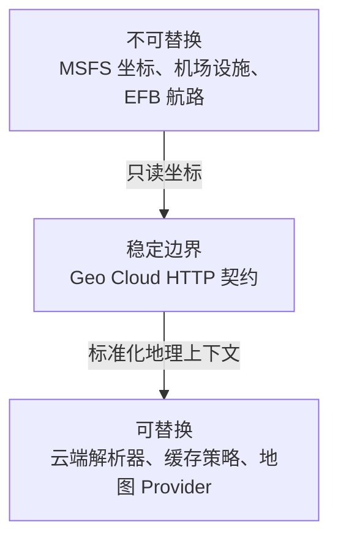

# 外部地理模块架构

**最后更新：** 2026-07-15
**对应命令：** `msfs external geo context`（查询外部地理上下文）

## 一句话说明

这个模块把“飞机坐标”转换成“城市、自然地貌、游戏 POI（兴趣点）等可读信息”，但它不决定使用哪一家地图服务：`msfs.exe`（命令行程序）只调用 `Geo Cloud`（云端稳定接口），地图供应商和云端数据都封装在 Geo Cloud 内部。

## 总体结构



重点：实线是已经确定的接口和职责；虚线表示未来可替换、目前不选型的地图 Provider（数据提供方）。

## 模块分工

| 层 | 对应代码/系统 | 做什么 | 明确不做什么 |
|---|---|---|---|
| Agent 层 | LiveKit Agent（智能体框架） | 执行 CLI，读取 JSON 结果 | 不直接连接 SimConnect 或地图 API |
| 命令层 | `src/cli/main.cpp`（参数和流程编排） | 识别 `external geo context`、选择坐标来源、组织最终 JSON | 不保存地理数据库，不选择地图厂商 |
| 原生读取层 | `msfsd.exe`（守护进程）+ `src/simconnect/` | 读取 `PLANE LATITUDE`、`PLANE LONGITUDE`、`PLANE ALTITUDE`；需要飞机下方地面高程时读取 `GROUND ALTITUDE` | 不访问 Geo Cloud，不理解城市/地址 |
| 外部地理层 | `src/external/geo_context.*`（云端客户端契约） | 校验坐标、读取配置、HTTPS 请求、映射错误码 | 不直连高德、必应、Azure 等 Provider |
| 云端边界 | Geo Cloud | 鉴权、缓存、超时、字段来源标记 | 不成为 MSFS 原生数据的权威来源 |
| 云端解析层 | PostGIS + 未来 Provider 适配器 | 组合自然地貌、游戏 POI、城市等地理信息 | 覆盖机场、EFB 航路或飞机真实坐标 |

飞机当前位置的地面海拔使用 `GROUND ALTITUDE`（飞机正下方地面高程）这个 MSFS 原生 SimVar（模拟变量）读取；Natural Earth 的阴影地形栅格只适合制图，不能作为精确海拔值。

## 当前云端数据清单

| 信息类别 | 当前来源 | 可提供的内容 | CLI 是否携带数据 |
|---|---|---|---|
| 飞机坐标、飞行高度、地面海拔 | MSFS SimConnect（模拟器原生接口） | 经纬度、飞机高度、`GROUND ALTITUDE`（地面海拔） | 否，实时读取 |
| 城市及细粒度地名 | GeoNames（云端 PostGIS） | 城市、乡镇、村庄、山峰、水系等命名要素 | 否 |
| 自然与基础地理 | Natural Earth（云端 PostGIS，15 图层） | 国家/省州、海洋、湖泊、河流、海岸线、山脉/沙漠/半岛等区域、冰川、冰架、珊瑚礁、岛屿 | 否 |
| 游戏专属兴趣点 | MSFS POI（云端 PostGIS） | 游戏内机场、直升机坪、聚落、地标与地貌 | 否 |
| 保护区 | 未接入 | 需要单独选择数据源、授权与更新策略 | 否 |

`natural.nearby`（附近自然要素）会保留具体类型，例如 `REEF`（珊瑚礁）、`GLACIATED_AREA`（冰川区）、`SEA`（海）或 `RANGE_MTN`（山脉）。`natural.ocean`（所在海洋）只在落点位于具名海洋时填写，不能把通用的世界海洋背景误作具体海域。

## 两条调用路径

### 1. 已知坐标：不启动模拟器

适用命令：

```powershell
msfs external geo context --lat 31.2304 --lon 121.4737 --alt-m 10 --detail coarse --json
```



这条路径不会启动 `msfsd.exe`（守护进程），也不会要求 MSFS 正在运行。

### 2. 从飞机读取坐标：先原生、后外部

适用命令：

```powershell
msfs external geo context --from aircraft --detail auto --json
```



这里有一个不能改变的顺序：飞机坐标来自 MSFS 原生接口；Geo Cloud 只能解释这个坐标，不能反过来提供或修正飞机位置。

## 请求、响应与错误边界

### CLI 到 Geo Cloud 的稳定请求

```json
{
  "lat": 31.2304,
  "lon": 121.4737,
  "alt_m": 10.0,
  "detail": "auto",
  "locale": "zh-CN"
}
```

- 坐标输入固定为 `WGS84`（全球通用经纬度坐标系）。
- `detail`（细节等级）只允许 `auto`、`coarse`（粗略）或 `full`（完整）。
- 请求使用 HTTPS，并以 `X-MSFS-Geo-Key`（接口密钥请求头）鉴权。

### Agent 收到的成功结果

```json
{
  "id": "cli-...",
  "ok": true,
  "data": {
    "origin": "external_geo_cloud",
    "context": {
      "administrative": {},
      "natural": {},
      "game_poi": {},
      "place": {},
      "_meta": {
        "source_map": {},
        "input_coordinate_system": "WGS84"
      }
    }
  }
}
```

`origin`（来源）说明结果来自外部 Geo Cloud；`context._meta.source_map`（字段来源映射）说明每一类字段最终来自云端的哪一个数据模块。`place` 只在 `detail=full` 且 Nominatim Provider 返回结果时出现；它不能覆盖 `administrative`、MSFS 原生设施、游戏 POI 或 EFB 航路。Agent 不应把这些字段误认为 SimConnect 原生数据。

### AI Agent 消费规则

AI Agent（智能体）只读取 `msfs.exe` 的标准输出 JSON；它不读取 Geo Cloud 的数据库、SSH 配置或 API Key。每次调用均按顶层 `ok`（是否成功）分支处理：

```json
{
  "id": "cli-...",
  "ok": true,
  "data": {
    "origin": "external_geo_cloud",
    "context": {
      "administrative": {
        "country": "图瓦卢",
        "admin1": "图瓦卢",
        "city": "Alapi Village"
      },
      "natural": {"ocean": null, "nearby": []},
      "game_poi": {"nearby": []},
      "nearby": {"features": []},
      "_meta": {
        "input_coordinate_system": "WGS84",
        "source_map": {"administrative": "mixed"}
      }
    }
  }
}
```

| JSON 路径 | Agent 可据此回答 | 处理规则 |
|---|---|---|
| `data.context.administrative.country`、`admin1`、`city` | 所在国家、省州、城市附近 | 仅使用非空值；城市为空时不得猜测。 |
| `data.context.natural.ocean`、`natural.nearby` | 海域、山脉、珊瑚礁、冰川等自然地貌 | 这是外部地理解释，不是模拟器原生飞行数据。 |
| `data.context.game_poi.nearby` | 游戏内 POI 附近情况 | 仅在列表有实际条目时陈述。 |
| `data.context.place` | 街道、地标、地址等现实世界地点补充 | 仅在存在时使用；必须说明它来自 Nominatim/OSM，而非 MSFS。 |
| `data.context.nearby.features` | 附近要素与距离 | 每项须结合自身 `source`（来源）解释。 |
| `data.context._meta.source_map` | 每个字段域的数据来源 | 不得把 GeoNames、Natural Earth 或 MSFS POI 说成 SimConnect 数据。 |

当 `ok` 为 `false` 时，Agent 只能读取 `error.code` 与 `error.message`，并且不得从失败响应猜测地点：

```json
{
  "id": "cli-...",
  "ok": false,
  "error": {
    "code": "EXTERNAL_GEO_UNAVAILABLE",
    "message": "Geo Cloud did not respond before the request timed out."
  }
}
```

`id` 用于请求关联和审计，不代表地理含义。`null`、空数组或缺失字段表示该类信息没有可用结果；它们不是“没有城市/POI/自然地貌存在”的现实世界断言。

### 关键错误码

| 错误码 | 含义 | Agent 的正确处理 |
|---|---|---|
| `SIM_POSITION_UNAVAILABLE` | `--from aircraft` 时 MSFS/SimConnect 不可用 | 告知用户需启动 MSFS；不要编造位置 |
| `EXTERNAL_GEO_CONFIG_INVALID` | 云端地址、密钥或超时配置缺失/无效 | 由部署者配置环境变量；不要重试地图厂商 |
| `EXTERNAL_GEO_AUTH_FAILED` | Geo Cloud 拒绝密钥 | 停止重试，检查云端与客户端的密钥是否一致 |
| `EXTERNAL_GEO_UNAVAILABLE` | 云端超时、网络失败或 5xx | 可稍后重试；仍可继续使用原生飞行功能 |
| `EXTERNAL_GEO_INVALID_REQUEST` | 坐标或细节等级不合法 | 修正参数；不要发送到云端 |

## 可替换点与不可替换点



已经确认、可以立即开发的部分：

1. CLI 到 Geo Cloud 的 HTTPS 请求格式。
2. WGS84 坐标输入、来源标记、错误码和密钥边界。
3. MSFS 原生数据优先，外部地理信息只能补充说明。
4. Geo Cloud 内的 PostGIS 自然地貌与 MSFS POI 数据职责。

当前可选 Provider：

1. Nominatim（OpenStreetMap）：在 Geo Cloud 内部为 `detail=full` 的坐标反查补充 `place`。公共实例必须使用 1 请求/秒限流、缓存和明确的 User-Agent；生产负载应改为自托管或可达的托管端点。

暂不决定的部分：

1. 城市、地址、通用 POI 使用哪个地图 Provider。
2. Provider 的套餐、额度、鉴权与地区策略。
3. Geo Cloud 是否引入裁剪版的城市数据集作为无网络降级方案。

将来替换地图 Provider 时，只改 Geo Cloud 的解析器；不改 CLI 参数、`ContextRequest`（地理上下文请求对象）、Agent 调用方式或 SimConnect 代码。

## 代码入口索引

| 文件 | 阅读顺序 | 作用 |
|---|---:|---|
| `src/cli/main.cpp`（CLI 主流程） | 1 | 从命令行参数进入 `run_external_geo_context()`（执行外部地理上下文） |
| `src/external/geo_context.h`（模块接口） | 2 | 查看 `ContextRequest`、`Config`、`ContextClient`（客户端抽象接口） |
| `src/external/geo_context.cpp`（云端实现） | 3 | 配置校验、HTTPS 调用、HTTP 错误映射 |
| `src/daemon/main.cpp`（守护进程入口） | 4 | `simvar.get` 如何读取 MSFS 原生变量 |
| `src/simconnect/simconnect_client.cpp`（SimConnect 实现） | 5 | 真正与 MSFS 通讯的代码 |

## 当前验证状态

- 已验证：构建、JSON 协议、命名管道、外部地理请求校验和云端配置校验。
- 已验证：未配置 Geo Cloud 时返回 `EXTERNAL_GEO_CONFIG_INVALID`，不会擅自访问第三方地图服务。
- 已验证：线上 Geo Cloud 成功返回海洋、珊瑚礁与冰川等 Natural Earth 要素，且带有 `geo_cloud_postgis:natural_earth` 来源标记。
- 已验证（2026-07-16，2026-07-22 复测）：七个全球代表性坐标的传输、WGS84/来源元数据及预期地理字段均通过；覆盖城市、远洋、山地、珊瑚礁、冰盖、沙漠与小岛。2026-07-22 的复测未启动 MSFS，直接坐标模式的传输、元数据和字段覆盖率均为 7/7。详见 [Geo Cloud 覆盖测试记录](../testing/geo-cloud-coverage.md)。
- 已部署（2026-07-22）：Geo Cloud 的 Nominatim 适配器已具备地点补充、缓存、限流和软降级。当前腾讯云主机连接公共 Nominatim 超时，Provider 配置为关闭，尚未完成真实 Provider 的线上验收。
- 待验证：运行中的 MSFS 2024 航班内执行 `--from aircraft` 的端到端流程。

## 关联文档

- [架构概览](overview.md)
- [外部 Geo Cloud 决策（ADR-003）](../adr/adr-003-external-geo-cloud.md)
- [外部地理上下文规格（Spec-003）](../specs/spec-003-external-geo-context.md)
