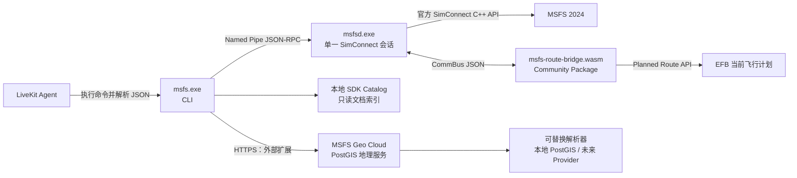
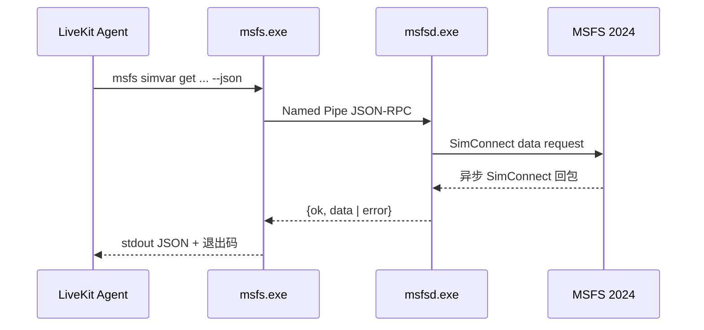
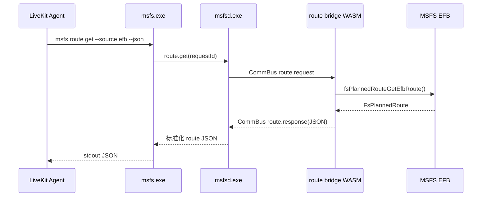

# 架构概览

**最后更新：** 2026-07-15

外部地理模块的完整调用逻辑、数据边界和可替换点见[外部地理模块架构](external-geo-module.md)。

## 分层架构



## 核心业务流程

### 通用 SimConnect 命令



### 读取当前 EFB 飞行计划



## 模块职责

| 模块                 | 职责                                             | 不负责                                                              |
| -------------------- | ------------------------------------------------ | ------------------------------------------------------------------- |
| `src/cli/`           | 参数校验、守护进程发现、JSON/NDJSON 输出、退出码 | SimConnect 调度、业务规则                                           |
| `src/daemon/`        | 单实例、命名管道、请求队列、超时、重连           | Agent 会话、外部地理服务                                            |
| `src/simconnect/`    | SDK 调用、消息泵、回包解析、数据定义缓存         | 定义新的航电或自动驾驶语义                                          |
| `src/simconnect/`    | SDK 调用、消息泵、回包解析、CommBus 航路请求关联 | 直接读取 EFB 内部文件                                               |
| `src/catalog/`       | 版本化的 SimVar、Key Event、单位索引             | 运行时替代 SDK                                                      |
| `wasm-route-bridge/` | Planned Route API 转换与 CommBus 响应            | Agent、网络或本地命名管道                                           |
| `src/external/`      | Geo Cloud 请求契约、HTTPS 客户端、可替换后端接口 | SimConnect 原生读取、飞行控制、地图 Provider 选择、全量本地地理数据 |

## 原生能力边界

核心 CLI 直接暴露的命名空间：

| 命名空间     | SDK 来源                          | 示例                                                     |
| ------------ | --------------------------------- | -------------------------------------------------------- |
| `system`     | SimConnect General / System State | `msfs system state --name AircraftLoaded`                |
| `simvar`     | SimVars + Data Definitions        | `msfs simvar get/set/batch/watch`                        |
| `key-event`  | Simulation Event IDs              | `msfs key-event send --name AP_MASTER --data 1 --unsafe` |
| `input`      | SimConnect Input Events           | `msfs input list` / `msfs input set --hash ... --unsafe` |
| `facilities` | SimConnect Facilities             | `msfs facilities nearest --type airport`                 |
| `flight`     | SimConnect Flights                | `msfs flight load --path flight.flt --unsafe`            |
| `ai`         | SimConnect AI Objects             | `msfs ai aircraft create-parked ... --unsafe`            |
| `camera`     | SimConnect Camera                 | `msfs camera acquire --unsafe` / `camera status`         |
| `route`      | WASM Planned Route + CommBus      | `msfs route get --source efb`                            |
| `catalog`    | 本地官方文档索引                  | `msfs catalog simvar search --query fuel`                |

不属于核心的能力必须显示命名为 `external`（外部数据服务）或 `compat`（兼容适配），例如 `msfs external geo`、`msfs compat flightplan-file`。

## 外部依赖

| 依赖                 | 用途                                                                                     | 是否核心                   |
| -------------------- | ---------------------------------------------------------------------------------------- | -------------------------- |
| MSFS 2024            | SimConnect 服务端、EFB、WASM 运行环境                                                    | 是                         |
| MSFS 2024 SDK        | C++/WASM 编译头文件、库和文档；构建后提供 `SimConnect.dll`（微软连接组件）给 `msfsd.exe` | 是（开发/构建/发布运行时） |
| Community Package    | 安装 `msfs-route-bridge.wasm`                                                            | 仅 EFB 飞行计划功能需要    |
| LiveKit Agent        | 调用 CLI 的上层 Agent                                                                    | 否                         |
| MSFS Geo Cloud       | 精简 Natural Earth 自然图层、MSFS POI、鉴权与来源归一化                                  | 否，`external geo`         |
| Geo Cloud 内部解析器 | 行政区、城市、地址、通用 POI 与地名搜索；具体 Provider 尚未选择                          | 否，不由 CLI 直接访问      |
| 地图、天气、航图服务 | `external` 扩展能力                                                                      | 否                         |

## 地图信息来源责任表（轻量化目标架构）

“权威来源”表示 CLI/Agent 在该字段冲突时必须相信的来源；“补充来源”只能丰富名称或描述，不能覆盖权威飞行数据。地图 Provider 尚未选择，CLI 只知道 Geo Cloud，不知道其内部的实现。

| 地图或飞行信息                           | 权威来源                                    | 结果 `source`（来源标识）      | 可用补充                   | 不允许替代者                 | 当前状态                                        |
| ---------------------------------------- | ------------------------------------------- | ------------------------------ | -------------------------- | ---------------------------- | ----------------------------------------------- |
| 飞机经纬度、高度、航向、速度             | MSFS SimConnect（微软模拟飞行原生接口）     | `native_simconnect`            | 无                         | Geo Cloud、任何地图 API      | 已实现读取基础能力                              |
| 最近机场、跑道、导航台、航点、ICAO       | MSFS `facilities`（原生设施接口）           | `native_simconnect_facilities` | Geo Cloud 可补机场显示名称 | 通用 POI、地址 API           | 已实现原生列表与本地 `radius-nm` 距离裁剪       |
| 当前 EFB 航路、SID、STAR、进近、跑道选择 | EFB Planned Route API（WASM）               | `native_efb`                   | Geo Cloud 仅可补地名显示   | 普通地图路径规划、Legacy GPS | 已实现；需安装 Community Package 并做游戏内验证 |
| 游戏内机场、地标、聚落、地貌 POI         | Geo Cloud 保存的 MSFS POI 数据              | `geo_cloud_msfs_poi`           | 通用 POI 可附加说明        | 通用 POI                     | Geo Cloud 现有数据，CLI 规划中                  |
| 国家、省州、城市、区县等行政上下文       | Geo Cloud 内部解析器                        | `geo_cloud_resolver`           | 无                         | SimConnect                   | Provider 未选择                                 |
| 海洋、湖泊、河流、山脉、自然区域         | Geo Cloud PostGIS 的精简 Natural Earth 图层 | `geo_cloud_postgis`            | 解析器的命名补充           | 通用 POI、SimConnect         | 需裁剪现有数据                                  |
| 地址、街道、建筑、通用周边 POI、地名搜索 | Geo Cloud 内部解析器                        | `geo_cloud_resolver`           | 无                         | SimConnect、MSFS POI         | Provider 未选择                                 |
| 道路、驾车/步行/骑行路径                 | Geo Cloud 内部地图解析器                    | `geo_cloud_resolver`           | 无                         | EFB 航路、SimConnect 航路    | 不属于当前 CLI 范围                             |
| 度分秒、单位、距离、方位角等纯转换       | CLI 本地数学计算                            | `local_math`                   | 无                         | 任何地图 API                 | 规划中                                          |

### 数据裁剪清单

| 旧 MCP 运行时数据                                  | 新架构处理方式                       | 原因                                                            |
| -------------------------------------------------- | ------------------------------------ | --------------------------------------------------------------- |
| GeoNames 全量城市/乡镇/地名/地貌数据               | 不进入 CLI；云端是否保留裁剪数据待定 | 避免客户端体积和预热成本，Provider 尚未选择。                   |
| Natural Earth 行政区和城市图层                     | 不进入 CLI；云端是否保留裁剪数据待定 | 仅在云端解析器确有需要时保留。                                  |
| Natural Earth 海洋、湖泊、河流、山脉、自然区域图层 | 保留精简版，仅存 Geo Cloud PostGIS   | 这些自然地貌不能稳定依赖通用 POI 查询。                         |
| OurAirports CSV                                    | 删除运行时依赖                       | MSFS `facilities` 是 ICAO、跑道、导航设施和附近机场的权威来源。 |
| MSFS POI `Master.csv`                              | 保留                                 | 该数据描述游戏内 POI，通用地图不能替代；体积较小。              |

这个表描述目标状态；当前 Geo Cloud 仍包含旧 PostGIS 数据，后续需按本表完成迁移后才算生效。

### Geo Cloud 响应的字段标识

同一份地理上下文可能混合多个数据源。实现 `external geo context` 时，`_meta`（元数据）必须为每个字段域标出实际来源，而不能只写笼统的 `cloud`：

```json
{
  "administrative": { "country": "...", "city": "..." },
  "natural": { "ocean": null, "river": "..." },
  "game_poi": { "landmark": null },
  "_meta": {
    "origin": "external_geo_cloud",
    "source_map": {
      "administrative": "geo_cloud_resolver",
      "natural": "geo_cloud_postgis",
      "game_poi": "geo_cloud_msfs_poi"
    },
    "input_coordinate_system": "WGS84"
  }
}
```

将来某字段由外部 Provider 补充时，只更新该字段的 `source_map` 值；MSFS 原生字段的来源标识绝不改变。

## 不变量（来自 ADR）

- `msfsd.exe` 是唯一拥有 SimConnect 会话的进程。
- CLI 的成功结果、失败结果和流式事件均为 JSON 或 NDJSON；日志不写入 stdout。
- 当前 EFB 飞行计划只通过 Planned Route API 获取；Legacy GPS Flight Plan SimVars 不能成为核心来源。
- 核心不会依赖 MCP、HTTP 或第三方地理服务。
- 外部地理命令可通过 HTTPS 调用 Geo Cloud，但不得改变核心 CLI 与 daemon 的 Named Pipe 通信边界。
- MSFS 原生坐标为 `WGS84`；外部 Provider 的坐标系转换只在 Geo Cloud 内处理，响应必须标注来源与坐标系。

## 当前运行状态与部署边界

- 面向最终用户的安装、Community 目录发现、升级与卸载规则见 [分发、安装与升级](../distribution.md)。
- CMake 在检测到 `MSFS2024_SDK`（SDK 根目录）后，会在构建 `msfsd.exe`（守护进程）时自动复制 SDK 内的 `SimConnect.dll` 到同一输出目录。
- `msfsd.exe` 延迟加载该 DLL：`status` 和 `catalog` 可在 DLL/模拟器未就绪时运行；首次使用任一 SimConnect 命令时才加载连接组件。
- 已验证 DLL 可被加载；没有运行中 MSFS 时，读取请求返回 `SIM_NOT_READY`。2026-07-17 已在运行中、且已加载航班的 MSFS 2024 环境完成基础 SimVar 端到端读取；新增命令和 EFB bridge 待下次游戏内回归。
- 当前候选桌面包为了本机运行验证携带 SDK 中的原生 `SimConnect.dll`。正式公开分发前仍需根据当前 SDK EULA 或微软书面说明确认该具体二进制属于可再分发代码；SDK 目录中存在 DLL 或安装器不能单独替代许可结论。当前自动复制仍只负责构建目录部署。
